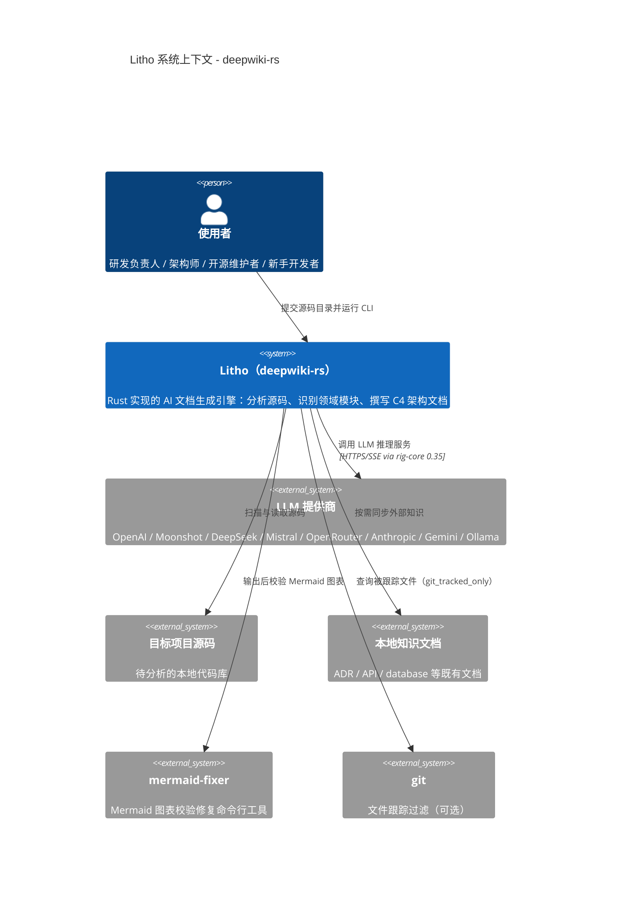

# Litho（deepwiki-rs）

Litho 是一个用 Rust 编写的高性能文档生成引擎，它的使命可以用一句话概括：**把"读懂一个项目再写出架构文档"这件事，从需要人类专家数天投入的苦差事，变成一个半分钟就完成的自动化流水线**。你只需指向任意一个源码目录，Litho 就会先像一位耐心的图书管理员一样扫描、拆解代码结构，再像一支分工明确的咨询团队（研究 Agent）一样从宏观到微观理解这个项目，最后像编辑一样把理解成果组织成一套专业、结构化的 C4 架构文档。

这个仓库本身也是一个绝佳的"自我说明"案例——Litho 对自己运行分析，就能产出你正在阅读的这套文档。它体现了该项目最核心的价值观：一切皆可被理解、被结构化、被自动化。Litho v1.6.0 由约 90 个 Rust 源文件、2.4 万行代码构成，不依赖任何外部数据库或常驻服务，是一个轻量的单二进制 CLI 工具。

## 它能做什么

Litho 的核心能力可以概括为"从源码到文档的全自动流水线"。简单来说，你给它一个项目的源码目录，它会自动分析代码结构、识别核心模块、梳理依赖关系，然后利用大语言模型（LLM）把所有这些信息组织成一套完整的 C4 模型架构文档。

**智能代码分析**——Litho 不只是扫描文件名，而是真正解析代码内容。它内置 12 种语言的处理器（Rust、JavaScript、TypeScript、PHP、React、Vue、Svelte、Kotlin、Python、Java、C#、Swift，见 `src/generator/preprocess/extractors/language_processors/mod.rs:44-57`），自动提取每个文件的源码依赖、接口定义与复杂度指标，再用 LLM 对目录与文件进行业务价值评估，形成一份结构化"档案"。

**多 Agent 深度研究**——研究阶段像一支咨询团队：先由 SystemContextResearcher 回答"这项目是干什么的、给谁用"，再由 DomainModulesDetector 划分出清晰的领域模块，ArchitectureResearcher 与 WorkflowResearcher 分别深挖架构与工作流，最后 KeyModulesInsight 与 BoundaryAnalyzer 逐模块给出见解并盘点对外接口（`src/generator/research/orchestrator.rs`）。

**多语言文档生成**——通过 `TargetLanguage` 枚举（`src/i18n.rs:5`）支持中文、英文、日文、韩文、德文、法文、俄文、越南文 8 种语言。选择中文时，输出文件自动命名为 `1.概述.md`、`2.架构.md`、`3.工作流.md`、`4.Deep-Exploration/`、`5.边界接口.md`、`6.数据库概览.md`（`src/i18n.rs:147-157`）。

**外部知识增强**——允许把既有架构决策记录（ADR）、API 文档、数据库文档等本地资料注入流程，让研究 Agent 交叉核验自己的分析结论，而不是闭门造车（`src/integrations/knowledge_sync.rs`）。

**成本与速度优化**——同一 LLM 推理请求以提示词 MD5 为键缓存到磁盘，重复运行直接命中，大幅节省费用（`src/cache/mod.rs`）；并支持在"高效模型"与"高质量模型"之间按输入规模动态切换（`src/llm/client/utils.rs`）。

## C4 Context 图（系统全景）

下面这张系统上下文图把 Litho 放在它的生态位中：左边是使用它的人，右边是它依赖的外部系统。值得注意的是，Litho 唯一的网络通讯对象是各家 LLM 提供商——它没有自身对外服务的 API，也不需要额外的存储服务，整个系统边界非常清晰。

这张图透露了两个关键设计决策：其一，**Litho 的推理能力完全外包给 LLM 厂商**，自身只负责编排、结构化与缓存，这让它可以轻装前行；其二，**对目标项目是只读式的分析**，不修改被分析的源码，只把成果写入独立的输出目录，因此可以放心地对任何仓库跑分析而无副作用。

## 技术选型背后的思考

Litho 选择 Rust 作为开发语言并非单纯追求"高性能"标签。作为一个 IO 密集型、需要高频并发调用外部 LLM API 的工具，Rust 配合 Tokio 异步运行时既能高效管理并发请求与缓存读写，又能借助 `serde`/`schemars` 把 LLM 输出的自由文本严格约束成结构化 JSON——这是整套流水线能够"可信地"自动化的地基。

| 技术领域 | 具体选择 | 为什么这样选 |
|---------|---------|------------|
| 语言与运行时 | Rust（edition 2024）+ Tokio 1.47 | 内存安全、单二进制分发方便、异步模型贴合"大量并发 LLM 请求"的 IO 密集场景 |
| Agent/模型框架 | rig-core 0.35 | 提供统一的 `Agent`、`Extractor`、`Tool` trait，让"一个 Agent 一次结构化解码"成为可能，避免自造轮子（`src/llm/client/providers.rs:514-692`） |
| 模型接入 | 8 家 Provider 枚举抽象（`ProviderClient`） | 厂商 API 格式差异大，用枚举封装后上层逻辑与厂商解耦，换模型只改配置 |
| 序列化 | serde/serde_json + schemars | LLM 输出的 JSON Schema 描述与宽松反序列化，容忍模型输出噪声（`src/types/code.rs:40-110`） |
| 文档格式 | Markdown + Mermaid | 人类可读、可版本化、GitHub 直接渲染，架构图用 Mermaid 文本化便于 diff |
| 缓存 | 自定义 MD5 键磁盘缓存 | LLM 推理既贵又慢，同 prompt 秒级命中；与 `--no-cache`/`--force-regenerate` 组合可精确控制 |
| 目录遍历 | walkdir | 递归扫描目标项目并控制深度，配合 git 跟踪过滤精确画像 |

## Litho 能做什么，不能做什么

像任何工具一样，理解 Litho 的边界比理解它的能力更重要。它擅长"理解现状并把它讲清楚"，但不擅长"替你改变现状"。明确这条边界，才能在最合适的场景发挥它的价值。

**它能做的事**：
- 对任意本地源码项目进行结构分析、领域划分、架构与工作流梳理，并生成完整 C4 文档集
- 借助外部知识文档（ADR、API 手册）对分析结论做交叉验证与补充
- 按 8 种语言输出风格统一的技术文档，满足国际化团队或开源社区需要
- 在 CI 中反复运行，用磁盘缓存把增量分析的成本压到极低

**它不做的事**：
- 不编译、不运行、不修改被分析的项目——它是"观察者"而非"参与者"
- 不维护自己的持久化数据库；它的"知识库"来自外部文档注入与 LLM，而非项目内建存储
- 不驻留后台服务或暴露 HTTP API——它是按需执行的 CLI，用完即走
- 不保证生成文档的"圣经级"正确性——复杂系统的边界判断仍建议人工复核关键章节（这也是本仓库所有文档保留置信度字段的原因）