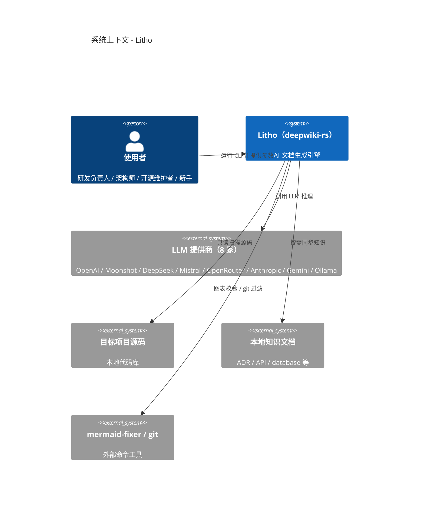
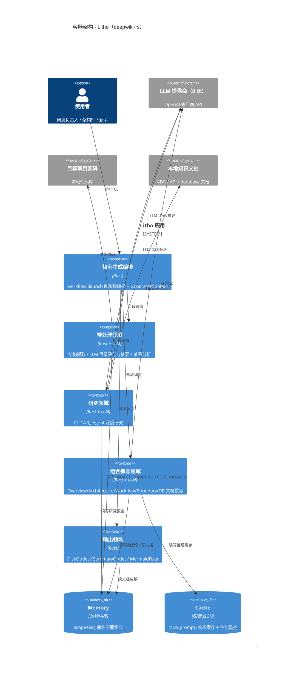
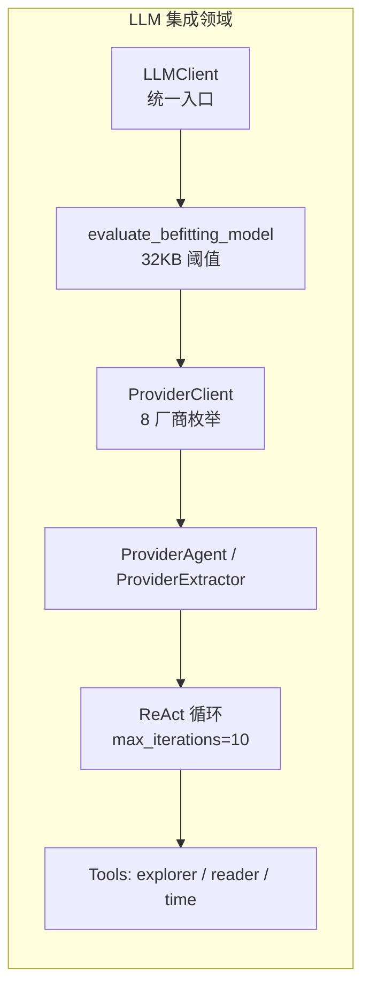
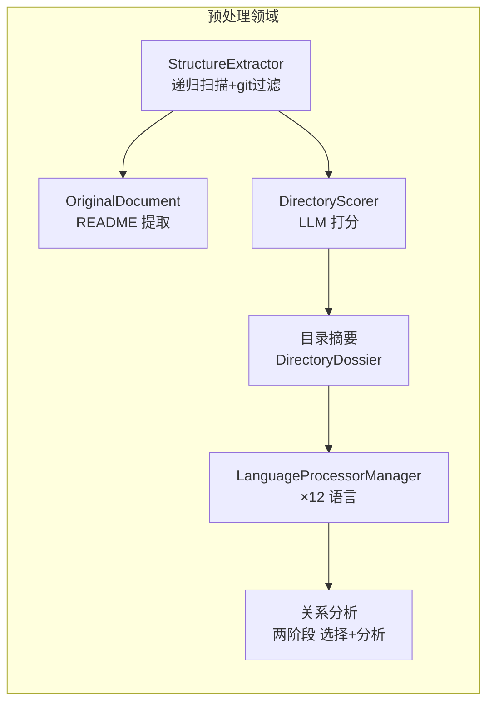
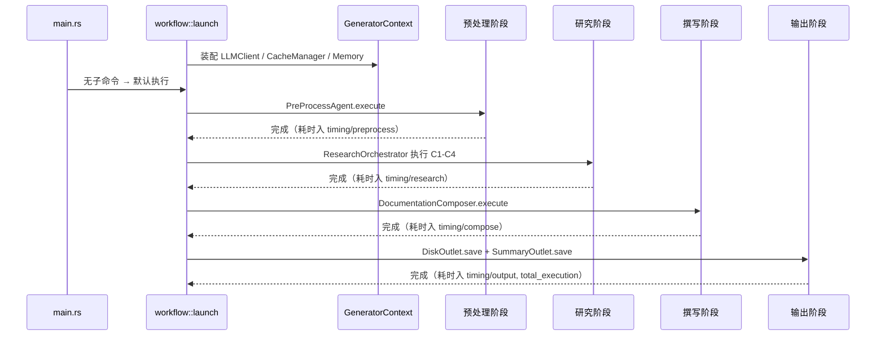
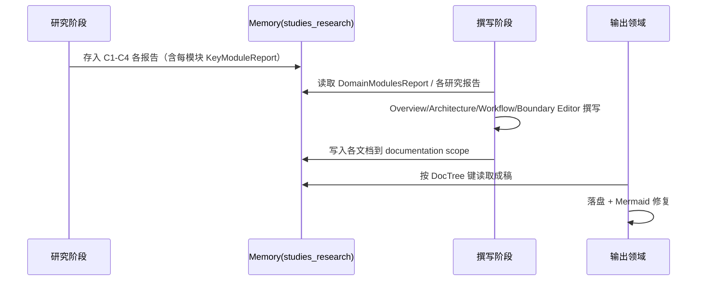

# 系统架构文档：Litho（deepwiki-rs）

**版本：** 1.0
**分类：** 内部架构文档
**生成日期：** 2026-09-13

---

## 1. 架构概述

Litho 的架构回答了这样一个问题：**如何让一群"会写代码注释但不懂业务背景"的 LLM，拼出一份专业且可靠的技术文档**。答案是把它组织成一条四阶段流水线——预处理、研究、撰写、输出，每一阶段处理一类确定性递增的问题：先是确定性的源码拆解，再是 LLM 主导的深度理解，最后是文档成稿与落盘。阶段之间通过一个命名空间化的内存字典（Memory scope）交接数据，形成"前车之鉴，后车之师"的接力式协作。

这样的设计取舍背后有一个核心观察：成品文档质量的上限取决于"对项目的理解深度"，而理解深度又取决于供给给研究 Agent 的信息是否结构化、是否够量。因此 Litho 把大量重量放在预处理（把源码变成干净的结构化情报）与研究（把情报变成领域结论）之上，撰写与输出阶段则相对"轻"——它们只是把已经想清楚的结论翻译成文档。理解了这个重心，整张架构图就很好读了。

### 1.1 设计理念

架构是由几条明确的原则支撑起来的，它们几乎都能在代码里找到直接证据。理解这些原则，比记住某个类名更能帮你快速定位问题。

**1. 流水线阶段隔离（Pipeline Discipline）**
代码把流程硬性切成预处理→研究→撰写→输出四个阶段，由 `workflow::launch`（`src/generator/workflow.rs:45-179`）顺序驱动，每个阶段只消费前序阶段的产物。这种"流水线纪律"让任何阶段都可以被独立跳过（`--skip-preprocessing` 等开关）、独立重跑，也让出错的排查范围大幅收窄——文档质量有问题，几乎总能定位到某一个阶段。

**2. 统一 Agent 契约（Uniform Agent Contract）**
流水线上有十几个智能体（预处理评分、C1-C4 研究、文档撰写），它们行为各异，但全部实现同一个 `StepForwardAgent` trait（`src/generator/step_forward_agent.rs`）：声明自己的输出类型、需要哪些数据源（`DataSource`）、用什么提示词模板。这就像给所有工人配了一张标准化的"岗位说明书"，新增或替换一个 Agent 的成本极低，整个团队的结构也因此变得一目了然。

**3. 确定性优先，LLM 增强为辅（Deterministic First）**
凡是能靠规则确定的事情，Litho 绝不让 LLM 猜测：文件结构靠 walkdir 扫出来（`structure_extractor.rs`），依赖与复杂度靠 12 种语言处理器静态提取（`language_processors/mod.rs:112-143`），只有"这个目录有什么用"这类真正需要语义理解的问题才交给 LLM。即便 LLM 评分失败，系统也只是打一条告警降级继续（`structure_extractor.rs:86-88`），绝不阻塞主流程。

**4. 宽容的 LLM 输出协议（Lenient Deserialization）**
LLM 生成 JSON 时总会"跑调"：该是数字的给字符串、缺字段、嵌套错位。Litho 没有选择苛求模型，而是写了一套"宽容反序列化器"（`src/types/code.rs:40-110` 的 `deserialize_*_lenient` 系列），能兜底纠偏大多数输出噪声。这是对现实残酷（LLM 输出的不可控）的一种务实妥协——不是追求完美，而是保证系统在噪声下依然可用。

### 1.2 核心架构模式

下面这张表把上述理念"翻译"成可识别到的具体架构模式。你会发现它们并非纸上谈兵：每一行都能指回代码中的具体实现。

| 模式 | 实现方式 | 目的 |
|------|---------|------|
| Pipeline 流水线 | `workflow::launch` 顺序驱动四阶段，阶段产物入 Memory | 职责分离、可跳过、可调试 |
| 多 Agent 分层研究 | `ResearchOrchestrator` 按 C1→C4 层级推进，C3 阶段按模块并行 | 由宏观到微观渐进理解，保证结论的层次性 |
| Strategy / Trait Object | `ProviderClient` 枚举封装 8 家厂商，`ProviderAgent`/`ProviderExtractor` 统一接口 | 上层逻辑与具体厂商解耦，换模型零改动 |
| 命名空间化内存总线 | Memory 按 scope+key 存取（`src/generator/preprocess/memory.rs` 等） | 数据流可追踪，避免阶段间字段互踩 |
| ReAct 工具循环 | `src/llm/client/react.rs` 控制 Agent 迭代调用内置工具 | 让模型能"查资料再作答"，提升长链推理质量 |
| 缓存优先（Cache Aside） | `CacheManager` 以 `MD5(prompt)` 为键读写磁盘 | 同类推理永不重做，成本与延迟双降 |
| 工厂 + 配置驱动 | `Config`（`src/config.rs`）集中管理 Provider/模型/路径/开关 | 一个配置对象贯穿全流程，行为可预期 |

### 1.3 技术栈概述

技术选型始终服务于"稳定、便宜、可分发"。Rust 单二进制让分发与部署变成复制一个文件的事；rig-core 与 `schemars` 让"LLM 结构化输出"这件事变得可靠；而 `pdf-extract`、`markdown`、`walkdir` 等则补齐了文档解析与扫描的拼图。这是一份没有炫技成分的务实清单，每一块都有明确用途。

| 类别 | 技术 | 用途 |
|------|------|------|
| Agent/模型框架 | rig-core 0.35 | Agent/Extractor/Tool 抽象与模型接入 |
| 网络 | reqwest 0.12 | LLM API 调用（HTTPS/SSE） |
| 异步 | tokio 1.47（full） | 运行时与并发控制 |
| 序列化 | serde / serde_json / schemars | 数据结构化与 LLM 输出约束 |
| CLI | clap 4.5（derive） | 参数解析与子命令 |
| 配置 | toml 0.9 | `litho.toml` 读取 |
| 文本/文档 | markdown、pdf-extract、regex | 本地文档解析 |
| 文件系统 | walkdir、pathdiff、glob | 目录遍历与路径处理 |
| 工具 | md-5、base64、uuid、chrono、futures、rand | 缓存键、时间戳、并行等杂项 |

---

## 2. 系统上下文（C4 Level 1）

系统上下文图在生态层面锁定 Litho 的边界：它只与使用者、LLM 提供商、目标项目与本地知识打交道。重复赘述意义不大，但值得再强调一句——Litho 自身没有任何入站网络接口，它的"组织边界"就是文件系统与各 LLM 厂商的调用，这让安全基线变得非常简单。

---

## 3. 容器视图（C4 Level 2）

把外部系统剥开，Litho 内部由几个"容器"构成：四个流水线子系统（预处理、研究、撰写、输出）、两个基础设施容器（Memory、Cache）以及贯穿全局的编排入口。这张图最值得关注的是数据流向——几乎一切都要经过 Memory 与 Cache，它们是整条生产线的"运输带"和"省钱仓库"。

### 3.1 领域模块职责

把容器进一步切细，我们看到 13 个内聚的领域模块。这张表既是在做"职责地图"，也是在给你排错时指路——当某个行为不对劲时，先对号入座找到它所属的领域，再深入对应目录。

| 模块/领域 | 路径 | 职责 | 关键抽象 |
|---------|------|------|---------|
| 核心生成编排 | `src/generator/workflow.rs`、`context.rs`、`agent_executor.rs` | 四阶段调度、上下文装配、Agent 执行 | `launch()`、`GeneratorContext`、`AgentExecuteParams`、`extract()` |
| 预处理领域 | `src/generator/preprocess/` | 结构提取、目录评分/摘要、关系分析 | `PreProcessAgent`、`StructureExtractor`、`DirectoryScorer`、`LanguageProcessorManager` |
| 研究领域 | `src/generator/research/` | C1-C4 多 Agent 研究 | `ResearchOrchestrator`、`AgentType`、各 Report 结构 |
| 组合撰写领域 | `src/generator/compose/` | 按报告撰写文档 | `DocumentationComposer`、6 个 Editor |
| 输出领域 | `src/generator/outlet/` | 落盘、汇总、Mermaid 修复 | `DiskOutlet`、`DocTree`、`SummaryOutlet`、`MermaidFixer` |
| LLM 集成领域 | `src/llm/` | 模型抽象、ReAct、内置工具 | `LLMClient`、`ProviderClient`、`ReActConfig`、`AgentToolFileExplorer` |
| 缓存领域 | `src/cache/` | 推理缓存与性能统计 | `CacheManager`、`CachePerformanceMonitor` |
| 内存管理领域 | `src/memory/` | scope+key 数据交接 | `Memory`、`MemoryMetadata` |
| 配置管理领域 | `src/config.rs`、`cli.rs` | 配置装载与 CLI 解析 | `Config`、`LLMProvider`、`Args` |
| 国际化领域 | `src/i18n.rs` | 语言、文件名、消息 | `TargetLanguage`、`get_doc_filename` |
| 知识集成领域 | `src/integrations/` | 外部知识同步与加载 | `KnowledgeSyncer`、`LocalDocsProcessor` |
| 类型体系领域 | `src/types/` | 领域数据契约与 lenient 解码 | `CodeInsight`、`CodePurpose`、`RelationshipAnalysis` |
| 工具与工具集领域 | `src/utils/` | 公共能力集 | `do_parallel_with_limit`、`TokenEstimator`、`PromptCompressor` |

---

## 4. 组件视图（C4 Level 3）

组件视图把放大镜对准两个最"重"的容器：LLM 集成与预处理。它们分别代表了系统的"推理肌肉"与"情报采集器"，也是大多数故障与性能瓶颈的发生地。

### 4.1 LLM 集成组件架构

**组件职责：**
- `LLMClient`（`src/llm/client/mod.rs`）：全局推理入口，负责模型选择、重试与超时。
- `evaluate_befitting_model`（`src/llm/client/utils.rs`）：按输入规模在 efficient/powerful 模型间抉择。
- `ProviderClient`（`src/llm/client/providers.rs:24`）：枚举封装 8 家厂商的 client/agent/extractor 构造。
- `ReActConfig`（`src/llm/client/react.rs`）：迭代次数、工具并发、摘要推理等推理策略参数。

### 4.2 预处理组件架构

**组件职责：**
- `StructureExtractor`（`src/generator/preprocess/extractors/structure_extractor.rs:28-100`）：产出 `ProjectStructure` 与目录/文件画像。
- `DirectoryScorer`（`src/generator/preprocess/agents/directory_scoring.rs:54+`）：LLM 评估目录业务价值，失败可降级。
- `LanguageProcessorManager`（`src/generator/preprocess/extractors/language_processors/mod.rs:31-144`）：静态提取依赖/接口/复杂度。

---

## 5. 关键流程

### 5.1 主流水线启动流程

`launch()` 是整条生产线的起点：它装配全局上下文，然后按顺序唤醒四个阶段。注意每一步都有 `--skip-*` 逃生舱与计时记录，这让"只想跑一半流程"和"定位慢在哪一阶段"都变得容易。

### 5.2 研究→撰写数据接力

下面的时序图展示了"研究结论如何变成文档"，这是全套文档可信度的来源：每个撰写 Editor 只消费自己对应的研究报告，绝不直接读透视源码。

---

## 6. 技术实现

### 6.1 关键架构模式

**统一的 Agent 执行路径**是 Litho 最值得学习的实现细节。所有 Agent 都走同一条路：声明数据源 → `AgentExecuteParams::prompt()`（`src/generator/agent_executor.rs`）组装提示词 → `LLMClient` 推理 → `extract()` 提取 JSON → lenient 反序列化为强类型 → 存入 memory。这条路径把"LLM 调用的脏活"（重试、退避、模型切换、字段纠偏）全部收敛在中间层，使每个 Agent 的实现只专注于"测了一个好提示词和好输出结构"。以 `DatabaseOverviewAnalyzer` 为例（`src/generator/research/agents/database_overview_analyzer.rs:45-120`），它只需要把"必须输出严格 JSON、字段形状如何"写清楚即可。

### 6.2 并发和并行策略

系统的并行策略集中在 `do_parallel_with_limit`（`src/utils/threads.rs:6-27`）：用 `AsyncSemaphore` 限制最大并发数，再以 `join_all` 聚合结果。最典型的应用是研究阶段的 C3 环节——对每个领域模块并行跑 `KeyModulesInsight`，以及预处理中的目录评分与摘要。这种"控制枪并发数"的做法很关键：LLM API 的限流与计费都随并发上升，Litho 选择用配置（`--max-parallels`、`--tool-concurrency`）把并发牢牢握在用户手里。

### 6.3 性能优化策略

性能优化的主战场不是 CPU，而是"别打多余的 LLM 调用"：
- **CacheManager 响应缓存**：同一提示词（MD5 键）命中直接返回上次结果，跨运行生效（`src/cache/mod.rs`）。
- **Token 预算估算**：`TokenEstimator`（`src/utils/token_estimator.rs:55-82`）区分中英文按比例折算 token，在超限前决定是否压缩或切换模型。
- **PromptCompressor 内容压缩**：对可能超标的代码洞察内容做分层压缩，保住关键结构（`src/utils/prompt_compressor.rs`）。
- **32KB 双模型策略**：常规推理用高效模型，输入超约 32KB 时升级到高质量模型并启用摘要推理（`src/llm/client/utils.rs`）。
- **两阶段关系分析**：索引过大时先让 LLM 挑选关键目录/文件，再对子集做关系分析，把一次超大推理换成两次可控推理（`src/generator/preprocess/agents/relationships_analyze.rs:27-60`）。

---

## 附录：架构决策记录（ADR）

**ADR 1：Memory 以 scope+key 命名空间做阶段间数据交接**
- **决策**：所有中间产物以 `(scope, key)` 写入进程内 Memory，而非共享一个全局状态或写中间文件（`src/memory/mod.rs`；三个 scope 定义于 `preprocess/memory.rs`、`research/memory.rs`、`compose/memory.rs`）。
- **原因**：四阶段流水线共享数据若用裸全局 Map，极易互相覆盖、难以追踪。用 scope+key 相当于"快递站按区域分拣"，每个区域只收自己的包裹。同时避免了反复读写磁盘文件的 IO 开销。
- **后果**：数据流清晰可追踪；代价是进程退出后中间产物即失，需整个流水线一次跑完（这也正是 Litho 工作区用磁盘持久化的原因）。

**ADR 2：集中式 LLMClient 抽象，而非各 Agent 直连厂商 SDK**
- **决策**：所有 LLM 调用收敛到 `LLMClient` + `ProviderClient`（`src/llm/client/*`），Agent 不直接触碰厂商 Client。
- **原因**：换厂商、换模型、加重试/缓存是横切关注点，散落在各 Agent 里会导致重复代码与不一致行为。集中后行为统一且可测。
- **后果**：新增厂商只需扩展 `ProviderClient` 枚举与 `create_client`/`to_agent`/`to_extractor`；代价是平台特有能力（某些厂商的高级参数）需逐厂暴露。

**ADR 3：确定性分析为主，LLM 只做语义增强**
- **决策**：文件结构、依赖、复杂度指标用规则提取（`language_processors/mod.rs`），仅目录价值、摘要、研究结论等语义任务交给 LLM。
- **原因**：规则的输出确定且免费（无 token 成本），而 LLM 在确定性任务上既贵又可能出错。混合模式兼顾了成本、速度与质量。
- **后果**：当语言处理器覆盖不全时（如生僻语言），依赖/接口提取会为空——因而保留了 lenient 反序列化与人工复核兜底。

**ADR 4：宽容反序列化容忍 LLM 输出噪声**
- **决策**：研究/预处理的所有 LLM 输出结构均配 `deserialize_*_lenient` 解码器（`src/types/code.rs:40-110`），遇类型漂移自动纠偏或置默认值。
- **原因**：实测 LLM 结构性输出总存在不可控噪声，严格要求只会频繁报错中断流程（参考了容忍性优先的工程原则）。
- **后果**：流水线更鲁棒，但个别纠偏可能"静默丢掉"信息——因此文档保留置信度字段并建议人工复核关键结论。

**ADR 5：按输入规模在 efficient/powerful 双模型间路由**
- **决策**：`evaluate_befitting_model` 以约 32KB 为阈值选择模型，超出则用强大模型并启用摘要推理（`src/llm/client/utils.rs`）。
- **原因**：轻量任务用贵模型是浪费成本，复杂长输入用弱模型是牺牲质量；动态路由让两者各得其所。
- **后果**：成本与质量在绝大多数场景取得平衡；代价是需要用户分别配置两个模型，配置复杂度略升。

**ADR 6：默认开启缓存，`--force-regenerate` 显式清空**
- **决策**：LLM 响应默认按 MD5(prompt) 落盘缓存（`src/cache/mod.rs`），`--force-regenerate` 时校验路径安全后清空（`workflow.rs:51-70`），另有 `--no-cache` 完全旁路。
- **原因**：文档生成的重复运行（CI、多语言多项目）极多，缓存能省下大量真金白银；把"清缓存"的破坏性操作放在显式参数且全体安全检查下，避免误删。
- **后果**：日常体验为"二次运行秒出结果"；但缓存可能掩盖 prompt 变化，变更 prompt 后需显式 `--force-regenerate` 或清理缓存目录。

**ADR 7：数据库文档按条件生成而非恒产**
- **决策**：`DocumentationComposer::has_database_files`（`src/generator/compose/mod.rs:55-72`）检测到 Database 目录/`CodePurpose::Database`/`.sql`/`.sqlproj` 才生成 `6.数据库概览.md`。
- **原因**：大量项目根本没有数据库层，为它们强行渲染一张空的 ER 图毫无意义；按需生成让文档集合与项目性质对齐。
- **后果**：无 DB 项目得到的是"未检测到数据库文件"的极简声明；DB 项目的判定完全交由预处理阶段的结构洞察驱动。