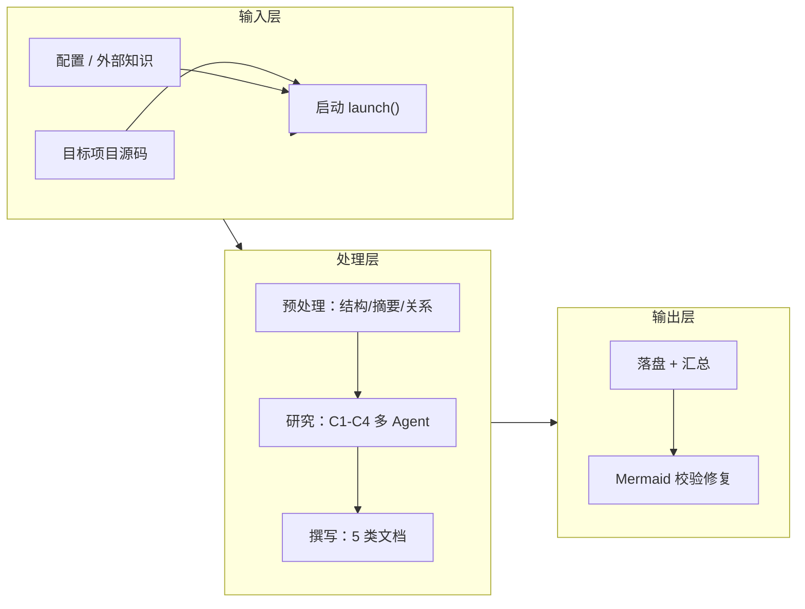
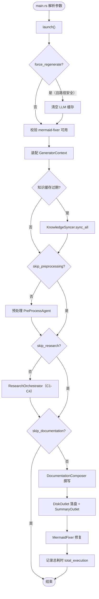
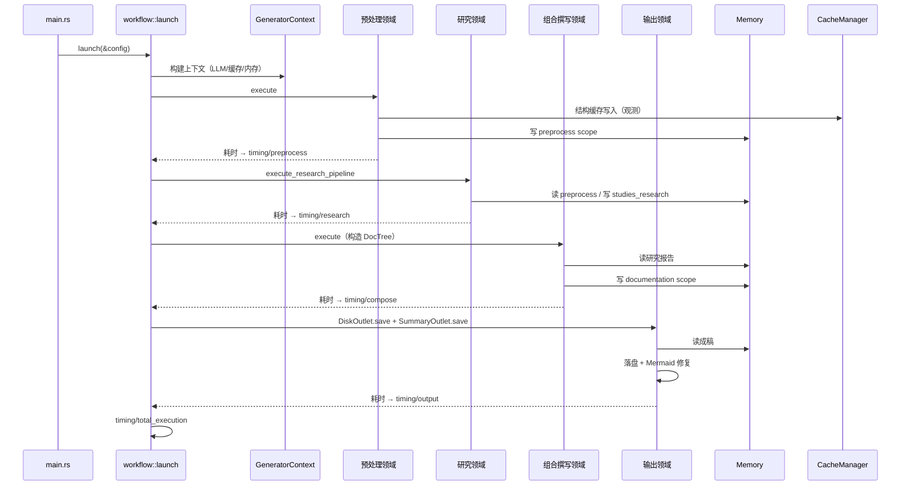
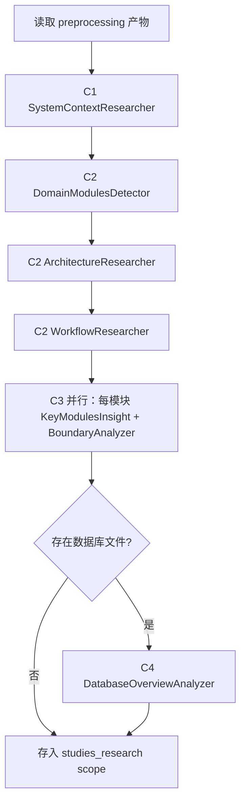
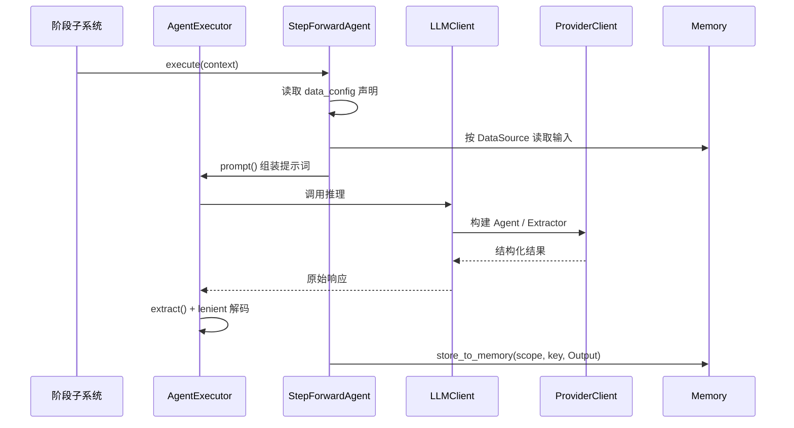
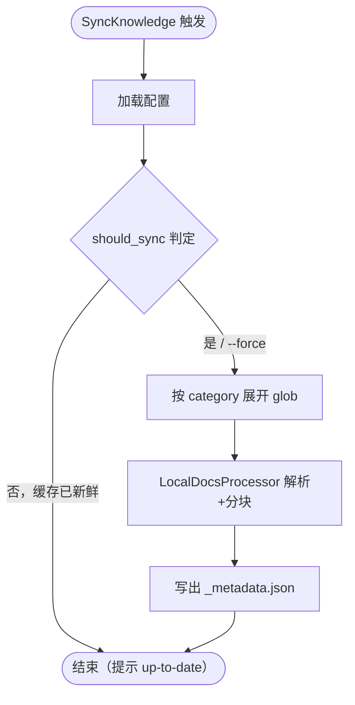

# 核心工作流

## 1. 工作流概述

Litho 的工作流可以用一条汽车生产线来理解——**原材料（目标项目源码）进厂后，先在"预处理车间"拆解分类成标准零件，再由"研究部门"的几位专家分别把零件拼成设计蓝图，最后由"编辑车间"把这些蓝图编写成用户手册，质检（Mermaid 校验）合格后装箱出厂**。整条生产线由 `workflow::launch` 这个"车间主任"统一指挥（`src/generator/workflow.rs:45`），每一个车间都有自己的开工令（`--skip-preprocessing`、`--skip-research`、`--skip-documentation`）和完工打卡（阶段耗时记入 `timing` scope）。

这条流水线的设计初衷是"每个阶段只做一种难度递增的事"：预处理做确定性拆解（零 LLM 成本、可重复），研究做语义理解（LLM 密集、决定质量上限），撰写做内容组织（把结论翻译成文档），输出做交付（落盘与质检）。理解了这个分工，"文档哪里来的、不好时该改哪"就有了清晰的答案。

### 1.1 系统架构与工作流理念

工作流理念可以浓缩成四个字：**接力加工**。任何阶段都不直接访问源码（除预处理之外），只吃前序阶段放在 Memory 里的"半成品"；任何阶段都不向后序阶段强加格式，只按约定的 scope+key 存取。这种松耦合让每个阶段可独立替换、独立回放，也让"研究结论不好"与"成稿写歪了"被明确区分为两类问题。

### 1.2 核心执行路径

下面的图把 `launch()` 的主路径压缩成了三层：输入、处理、输出。注意"Mermaid 修复"在输出之后仍然会执行，它是最后一道质检，默默确保你看到的每一张架构图都能被渲染。

---

## 2. 主要工作流

### 2.1 主流程：完整文档生成

这是 Litho 的"当家花旦"，也是用户不传子命令时默认执行的工作流（`src/main.rs:27`）。它把前面的理念落成具体的代码路径：从解析配置到输出一套完整的中文文档集，全程只有两个硬性外部依赖（mermaid-fixer 检查、可选的知识同步），其余全部自洽。

#### 流程图

#### 时序图

下面这张时序图是上一个流程图的"协作视角"，重点展示主流程与记忆/缓存基础设施之间的交互：阶段产物写入 Memory、LLM 推理走缓存、耗时打卡进 timing scope。

#### 阶段说明

| 阶段 | 执行者 | 输入 | 输出 | 说明 |
|------|-------|------|------|------|
| 配置与启动 | `workflow::launch` | CLI 参数 / `litho.toml` | `GeneratorContext` | 校验 mermaid-fixer、清缓存（force）、知识同步判断 |
| 预处理 | `PreProcessAgent` | 目标项目源码 | ProjectStructure / CodeAndDirectoryInsights / RelationshipAnalysis | 确定性与 LLM 混合，产物入 preprocess scope |
| 研究 | `ResearchOrchestrator` | preprocess 产物 | C1-C4 各研究报告 | C3 阶段按模块并行（`do_parallel_with_limit`） |
| 撰写 | `DocumentationComposer` | studies_research 报告 | 各文档成稿 | 固定顺序：Overview→Architecture→Workflow→KeyModules→Boundary→[DB] |
| 输出 | `DiskOutlet` + `SummaryOutlet` | documentation scope | `output_path` 下 6 类文档 | 先清目录再写，随后 Mermaid 修复 |

### 2.2 研究管线：C1→C4 递进式深研

研究阶段是整个文档体系的"智囊"。它像一支由七位专家组成的咨询团队，从"这是不是一个工程"开始，逐级追问到"每个模块内部长什么样、对外暴露什么"。每级研究都以前级结论为输入，最终沉淀到 `studies_research` 内存作用域。

#### 流程图

#### 阶段说明

| 层级 | Agent | 回答的问题 | 输出类型 |
|------|-------|-----------|---------|
| C1 宏观 | `SystemContextResearcher` | 项目是什么、为谁服务、边界在哪 | `SystemContextReport`（research/types.rs:995） |
| C2 中观 | `DomainModulesDetector` | 系统由哪些领域模块构成、如何协作 | `DomainModulesReport`（:1161） |
| C2 中观 | `ArchitectureResearcher` / `WorkflowResearcher` | 架构风格与核心业务流程 | Architecture/Workflow 报告 |
| C3 微观 | `KeyModulesInsight` / `BoundaryAnalyzer` | 每个模块内部实现、对外边界接口 | `KeyModuleReport`（:1134）/ `BoundaryAnalysisReport`（:1182） |
| C4 数据库 | `DatabaseOverviewAnalyzer` | 若存在 SQL 项目则产出库表概览 | `DatabaseOverviewReport`（:1311） |

### 2.3 单 Agent 执行：一次推理的完整旅程

不管是最轻的目录评分还是最重的 C1 研究，每个 Agent 都走同一条标准路径。这条路径值得单独讲清楚，因为它决定了"一次 LLM 调用到底发生了什么"——从声明数据源，到提示词组装，到模型路由与重试，再到宽容解码落库。

#### 时序图

#### 阶段说明

| 步骤 | 执行者 | 说明 |
|------|-------|------|
| 数据源声明 | `StepForwardAgent` | `required_sources`/`optional_sources` 声明该 Agent 吃什么（step_forward_agent.rs:34-82） |
| 提示词组装 | `AgentExecuteParams::prompt` | 注入目标语言提示词与格式化后的数据源内容（agent_executor.rs） |
| 模型路由 | `evaluate_befitting_model` | 按输入规模在 efficient/powerful 间选择（llm/client/utils.rs） |
| 推理执行 | `ProviderClient` | 8 厂商 x Agent/Extractor 四种组合，指数退避重试 |
| 宽容解码 | `extract()` + lenient | 把 LLM 文本校正为强类型 `Agent::Output` |

### 2.4 知识同步子命令

`litho sync-knowledge`（`src/main.rs:33-37`）是主流程之外的独立子命令，专门负责把外部知识落进本地缓存，供后续研究/撰写 Agent 作"外脑"使用。它遵循"能不同步就不同步"的原则：缓存存在且无文件变化时直接跳过。

#### 流程图

---

## 3. 并发与异步模型

Litho 全程基于 Tokio 异步运行时，但它的"并发"是有纪律的：绝不无限度地同时轰炸 LLM API。`do_parallel_with_limit`（`src/utils/threads.rs:6-27`）用 `AsyncSemaphore` 限制并发数，再用 `join_all` 聚合，是研究阶段 C3（逐模块并行洞察）、预处理目录评分/摘要等所有"批量 LLM 任务"的并发底座。并发上限通过 `--max-parallels` 与 `--tool-concurrency` 交给用户掌控——毕竟 LLM 的价格与限流都随并发曲线上升，把枪栓交给用户比自作主张安全得多。

Agent 内部的工具调用（`tools/file_explorer.rs` 等）同样受并发约束：`tool_concurrency=4` 的默认值限制了单个 Agent 并行执行文件探索的次数，避免一个 Agent 瞬时发出过多本地 IO（`src/llm/client/react.rs`）。

## 4. 错误处理策略

Litho 的错误处理哲学可以概括为两句：**"能降级就别中断，需中断就先自查"**。它把错误分成三类处理：

1. **可降级的软错误**：LLM 目录评分失败仅打告警继续（`structure_extractor.rs:86-88`）；知识同步失败仅提示不影响主流程（`workflow.rs:96-101`）；文档缺失只记告警不中断落盘（`outlet/mod.rs:105-109`）。选择这些失败继续的原因：它们的产物要么有确定性兜底，要么是锦上添花，不值得为此阻塞整条生产线。
2. **硬性前置检查**：`mermaid-fixer` 缺失直接中止（`workflow.rs:73-75`）；`--force-regenerate` 指向"根目录或单段路径"这类可疑缓存目录直接拒绝执行（`workflow.rs:53-62`）。这类错误发生在"写入/破坏"之前，能预先拦截就绝不走到一半再反悔。
3. **LLM 调用级弹性**：`retry_with_backoff` 指数退避重试瞬时故障，失败后再尝试切换到 powerful 模型兜底；ReAct 循环用 `max_iterations` 防止 Agent 陷入无休止的工具调用。宽容解码（`extract()` + lenient）则把"输出格式不达标"从致命错误降级为可容忍的噪声纠偏（`src/types/code.rs:40-110`）。

这套策略的共同逻辑是：**让影响面最小、可恢复性最大、破坏性操作前置拦截**——既保证了流水线的稳健，也保留了人工干预的窗口。