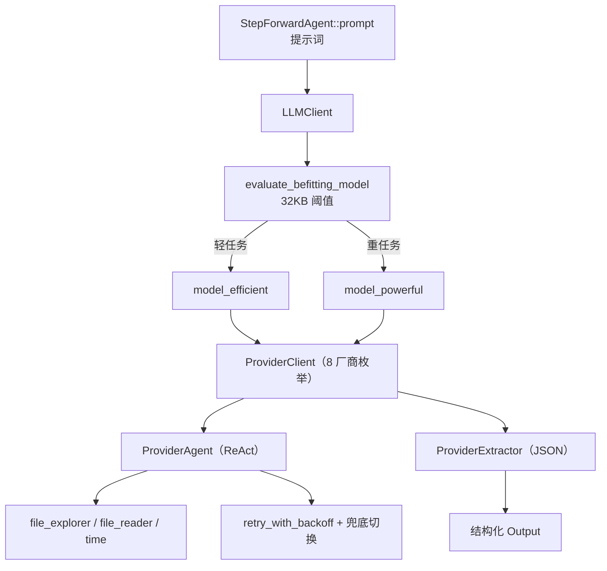

# LLM 集成领域

**模块路径**：`src/llm/`
**生成日期**：2026-09-13

---

## 概述

LLM 集成领域是整个 Litho 的"推理中枢"。如果把整条文档流水线比作一座工厂，预处理负责进货拆解、研究负责分拣判断、撰写负责组装成文，那么这里就是工厂的"动力车间"——所有需要"动脑"的操作，无论多轻多重，最终都要推到这家动力车间来完成。它的核心贡献在于：把"调用大模型"这件脏活（不同厂商、不同格式、失败重试、模型切换、结构化解码）全部收敛在统一接口 `LLMClient` 后面，让上层每个 Agent 都只需关心"我要什么输出"，而不用操心"这通电话怎么打出去"。

这个领域也因此成为架构决策最密集的地方：如何抽象 8 家厂商、如何平衡高效与高质量模型、如何让模型严谨输出 JSON、如何安全地给模型一把"浏览文件系统"的工具。这四件事分别落在 `ProviderClient`、`evaluate_befitting_model`、`Extractor` 体系与三个内置工具上。

## 核心功能点

1. **多厂商统一抽象**：`ProviderClient`（`src/llm/client/providers.rs:24`）用枚举封装 OpenAI/Moonshot/DeepSeek/Mistral/OpenRouter/Anthropic/Gemini/Ollama 八家客户端，并统一提供 `create_client`、`to_agent`、`to_agent_with_tools`、`to_extractor` 四类构造能力（providers.rs:44-519）。
2. **双模型动态路由**：`evaluate_befitting_model`（`src/llm/client/utils.rs`）按输入规模在约 32KB 阈值两侧选择 `model_efficient` 或 `model_powerful`，轻任务不浪费、重任务不缩水。
3. **ReAct 工具循环**：`ReActConfig`（`src/llm/client/react.rs`）默认 `max_iterations=10`、`tool_concurrency=4`、`enable_summary_reasoning=true`，让模型能在工具辅助下迭代作答。
4. **结构化抽取**：`ProviderExtractor`（providers.rs:665）把放飞的自由文本约束成可反序列化的 JSON，配合 lenient 解码器（`src/types/code.rs:40-110`）容忍噪声。
5. **沙箱内置工具**：`AgentToolFileExplorer`（`src/llm/tools/file_explorer.rs`）、`AgentToolFileReader`（`file_reader.rs`）、`AgentToolTime`（`time.rs:69-101`）——前两者用 `resolve_path_within` 做路径沙箱，越界请求以可读错误提示让 Agent 重试而非裸报错。

## 关键组件

| 组件/类型 | 文件路径 | 核心职责 |
|---------|---------|---------|
| `LLMClient` | `src/llm/client/mod.rs` | 统一入口：模型选择、`retry_with_backoff` 重试、超时 |
| `ProviderClient` | `src/llm/client/providers.rs:24` | 8 厂商枚举，构造 Agent/Extractor |
| `ProviderAgent` | `src/llm/client/providers.rs:514` | 统一 Agent 句柄（带/不带工具） |
| `ProviderExtractor` | `src/llm/client/providers.rs:665` | 统一 Extractor 句柄（结构化 JSON） |
| `evaluate_befitting_model` | `src/llm/client/utils.rs` | 32KB 阈值双模型路由 |
| `ReActConfig` | `src/llm/client/react.rs` | 迭代/并发/摘要推理策略 |
| `AgentToolFileExplorer` | `src/llm/tools/file_explorer.rs:16` | list_directory/find_files/get_file_info |
| `AgentToolFileReader` | `src/llm/tools/file_reader.rs:14` | 行区间读取与编码探测 |
| `AgentToolTime` | `src/llm/tools/time.rs:11` | 本地/UTC 时间与时戳 |

## 内部数据流

**关键步骤说明**：
1. 上层 Agent 只调用 `LLMClient`，模型选择在 `evaluate_befitting_model` 内部完成（`src/llm/client/utils.rs`）。
2. `ProviderClient` 按 `Config.llm_provider` 选择厂商，构建带 ReAct 能力的 `ProviderAgent`（providers.rs:441 起）。
3. 工具调用受 `tool_concurrency` 限制；推理失败走 `retry_with_backoff`，必要时切换强大模型兜底。

## 关键接口与扩展点

- **`ProviderClient` 枚举扩展**：新增厂商需同步扩展 `create_client`（providers.rs:44）、`to_agent`（:146）、`to_agent_with_tools`（:285）、`to_extractor`（:441）四处 match。
- **`Tool` trait（rig）**：内置工具实现了 rig 的 `Tool` trait（`definition`/`call`，如 `time.rs:69-101`），新增工具沿用同一接口即被 ReAct 循环识别。
- **`ReActConfig`**：迭代上限、并发、摘要推理开关是推理行为的关键旋钮（`src/llm/client/react.rs`）。

## 与其他模块的交互

| 交互模块 | 方向 | 接口/协议 | 说明 |
|---------|------|---------|------|
| 全部 Agent（预处理/研究/撰写） | 被依赖 | `LLMClient` | 所有推理走统一入口（`src/generator/agent_executor.rs`） |
| 配置管理 | 依赖 | `Config` / `LLMProvider` | 厂商与模型选择来自配置（`src/llm/client/mod.rs`） |
| 缓存领域 | 依赖 | MD5 响应缓存 | 推理响应先查缓存再落库（`src/cache/mod.rs`） |
| 工具与工具集 | 依赖 | `resolve_path_within`、`file_utils` | 工具沙箱与文件判定（`src/llm/tools/file_explorer.rs:12`） |
| 类型体系 | 被依赖 | `schemars::JsonSchema` | Agent 输出结构描述与 lenient 解码（`src/types/*`） |

## 跨模块协作场景

> 本模块在核心业务流程中的角色是"动力车间"：任何一次 Agent 执行都经由它完成推理。

**在单 Agent 执行流程中**：本模块承接提示词并返回结构化结果。具体参与：
- 步骤 1：`AgentExecuteParams::prompt()`（`src/generator/agent_executor.rs`）把数据源与提示词模板组装成完整请求。
- 步骤 2：`evaluate_befitting_model` 判定模型，`ProviderClient` 构建 Agent——输入含工具场景走 `to_agent_with_tools`，追求精确 JSON 走 `to_extractor`。
- 步骤 3：结果经 `extract()` 提取后交给上层 lenient 解码为强类型 `Agent::Output`，再 `store_to_memory`（`src/generator/step_forward_agent.rs`）。

**在研究流水线中**：研究阶段对每个领域模块并行调用（`do_parallel_with_limit`），这些并发推理统一汇聚到这里，由 `tool_concurrency` 等参数限制"一次最多同时几通电话"。

## 性能考量

- **缓存优先**：`CacheManager` 以 `MD5(prompt)` 为键，命中即免推理（`src/cache/mod.rs`）。
- **双模型路由**：约 32KB 阈值让轻任务用高效模型省钱省时，重任务用强大模型保证质量（`src/llm/client/utils.rs`）。
- **并发受限**：ReAct 的 `tool_concurrency=4` + 全局 `max_parallels` 限制并发推理数，防止限流与费用失控（`src/llm/client/react.rs`）。
- **指数退避重试**：瞬时失败自动重试并扩大间隔，减少人为干预。

## 实现亮点

1. **"引用力强的可读错误"沙箱**：文件工具越界时不是裸抛错误，而是返回带指引的错误结果（`tools/file_explorer.rs:50-59`），让 Agent 明白"要用相对路径"并自我纠正——这是把 LLM 当作协作者而非故障源的成熟设计。
2. **Agent / Extractor 双形态**：同一厂商既能构建工具型 Agent（探索推理），也能构建抽取型 Extractor（严格 JSON），两者的取舍交由上层按任务性质选择（`providers.rs:514-692`）。
3. **数据源显式声明**：配合 `StepForwardAgent.data_config`（`src/generator/step_forward_agent.rs:34-82`），LLM 集成知道每个 Agent 的"胃口"，从而精准喂料、避免喂毒。