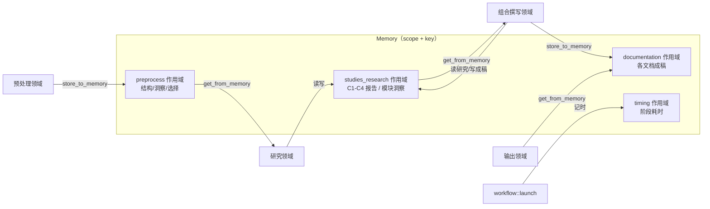

# 内存管理领域

**模块路径**：`src/memory/`
**生成日期**：2026-09-13

---

## 概述

内存管理领域的载体是一个朴实无华的数据结构——一个进程内的 `Memory` 字典，但它支撑起了整条流水线最关键的协作方式。你可以把它想象成快递站的"分拣中转台"：预处理车间把货物（结构化洞察）贴好标签放上特定货架，研究部门只从自己那排货架取件，组合撰写部门再从未一批货架取件。**每个货架有自己的 scope，每件货物有唯一的 key**，谁放谁取一目了然，永远不会出现"我把你的包拿走了却不知道"。这正是 Litho 各阶段能够松耦合接力、又保持数据流可追踪的核心机制。

这个模块虽然实现很薄，却是架构决策密度极高的地方：它决定了阶段间传递什么、以什么键传递、谁能看见什么。三个业务 scope（`preprocess`/`studies_research`/`documentation`）加上一个 `timing` scope，几乎就是整个流水线的"内部约定文档"。

## 核心功能点

1. **作用域隔离**：`MemoryScope::PREPROCESS`（`src/generator/preprocess/memory.rs`）、`STUDIES_RESEARCH`（`src/generator/research/memory.rs`）、`DOCUMENTATION`（`src/generator/compose/memory.rs`）三个业务 scope 各自装一类产物，互不干扰。
2. **泛型存取**：`store_to_memory(scope, key, value)` / `get_from_memory::<T>(scope, key)`（`src/generator/context.rs`）基于 serde_json 泛型读写任意类型。
3. **标准键约定**：`ScopedKeys`（`preprocess/memory.rs`）定义 `PROJECT_STRUCTURE`、`CODE_INSIGHTS`、`DIRECTORY_SELECTION` 等键；研究/撰写侧用 `KeyModulesInsight_{domain_name}` 这类组合键逐模块存取。
4. **计时统计**：`TimingScope::TIMING` + `TimingKeys`（`src/generator/workflow.rs:19-43`）记录每阶段耗时，供汇总报告展示。

## 关键组件

| 组件/类型 | 文件路径 | 核心职责 |
|---------|---------|---------|
| `Memory` | `src/memory/mod.rs` | scope+key 命名空间字典 |
| `MemoryMetadata` | `src/memory/mod.rs` | 条目元数据（写入时间等） |
| `MemoryScope::PREPROCESS` | `src/generator/preprocess/memory.rs` | 预处理产物作用域 |
| `ScopedKeys` | `src/generator/preprocess/memory.rs` | 预处理标准键（CODE_INSIGHTS 等） |
| `STUDIES_RESEARCH` | `src/generator/research/memory.rs` | 研究产物作用域 |
| `DOCUMENTATION` | `src/generator/compose/memory.rs` | 成稿作用域 |
| `TimingScope` / `TimingKeys` | `src/generator/workflow.rs:19-43` | 阶段计时键 |
| `store_to_memory` / `get_from_memory` | `src/generator/context.rs` | GeneratorContext 上的存取助手 |

## 内部数据流

**关键步骤说明**：
1. 预处理结束把 `CodeAndDirectoryInsights` 等写入 `preprocess`（`src/generator/preprocess/memory.rs` 的 `ScopedKeys::CODE_INSIGHTS`）。
2. 研究阶段读 `preprocess`、写 `studies_research`（含逐模块 `KeyModulesInsight_{domain}` 键）。
3. 撰写阶段读 `studies_research` 成稿后写 `documentation`；输出阶段按 `DocTree` 键从 `documentation` 取文落盘（`src/generator/outlet/mod.rs:85-102`）。

## 关键接口与扩展点

- **`MemoryScope` + `ScopedKeys`**：新协作者只需新增 scope 或 key 常量即可接入既有内存总线，无需改动 `Memory` 本体。
- **泛型 `store_to_memory`/`get_from_memory`**：支持任意 `Serialize + Deserialize` 类型，新增数据类型零成本接入。
- **`DocTree` 对接**：输出现读取的是 `documentation` 作用域中与 `DocTree` 键一致的成稿（`outlet/mod.rs:85-90`），因此撰写侧键的命名需与 `DocTree` 对齐。

## 与其他模块的交互

| 交互模块 | 方向 | 接口/协议 | 说明 |
|---------|------|---------|------|
| 核心生成编排 | 被依赖 | `Memory` 挂载于 Context | `Arc<RwLock<Memory>>` 构建入 `GeneratorContext`（`src/generator/workflow.rs:82-89`） |
| 预处理/研究/撰写/输出 | 被依赖 | `store_to_memory`/`get_from_memory` | 四阶段的唯一内部交接通道 |
| 组合撰写 | 被依赖 | `DOCUMENTATION` scope + `DocTree` 键 | 成稿存取后落盘（`src/generator/outlet/mod.rs:85-90`） |
| 输出领域 | 被依赖 | 泛型 `get_from_memory::<String>` | 取 markdown 成稿写盘 |

## 跨模块协作场景

> 本模块在核心业务流程中的角色是"分拣中转台"：它是四个阶段共同信任的唯一内部通信枢纽。

**在完整文档生成流程中**：本模块把四个阶段串成接力。具体参与：
- 步骤 1（预处理→研究）：`preprocess` scope 存放结构/洞察/选择，研究阶段按 `DataSource` 读取。
- 步骤 2（研究→撰写）：`studies_research` scope 的 C1-C4 报告被各 Editor 消费；逐模块 `KeyModulesInsight_{domain}` 供深探文档直接引用。
- 步骤 3（撰写→输出）：`documentation` scope 的成稿被 `DiskOutlet` 按 `DocTree` 键取出落盘。

**在计时与汇报场景中**：本模块的 `timing` 作用域承载每阶段耗时（`workflow.rs:19-43`），供 `SummaryOutlet` 汇总为性能报告。

## 性能考量

- **全程内存零 IO**：阶段间数据交接在进程内完成，无磁盘往返（对比把中间结果落盘的方案，这是性能优势）。
- **`RwLock` 读多写少**：多 Agent 并行读、单点写，读写锁比互斥锁并发度更高（`workflow.rs:82`）。
- **进程生命周期内有效**：一次运行结束即挥发——意味着"跳过阶段再次运行"（`--skip-preprocessing`）只在同一进程的 warm run 猜测中有效，跨进程需整条跑完（`workflow.rs:105-107` 的告警即为此而设）。

## 实现亮点

1. **scope+key 而非裸 Map**：用作用域分区替代全局共享变量，从小处防止了"字段互踩"这一流水线数据事故的根源。
2. **键即接口**：`KeyModulesInsight_{domain}` 这类组合键让"数据在哪"直观可查，配合 `ScopedKeys` 常量，把内部协定显式化、可 grep。
3. **泛型 + lenient 兼容**：存储层泛型序列化，配合各结构的宽限解码器，保证"两端类型即便有偏差也能交接"——与 LLM 输出噪声共存的务实策略。