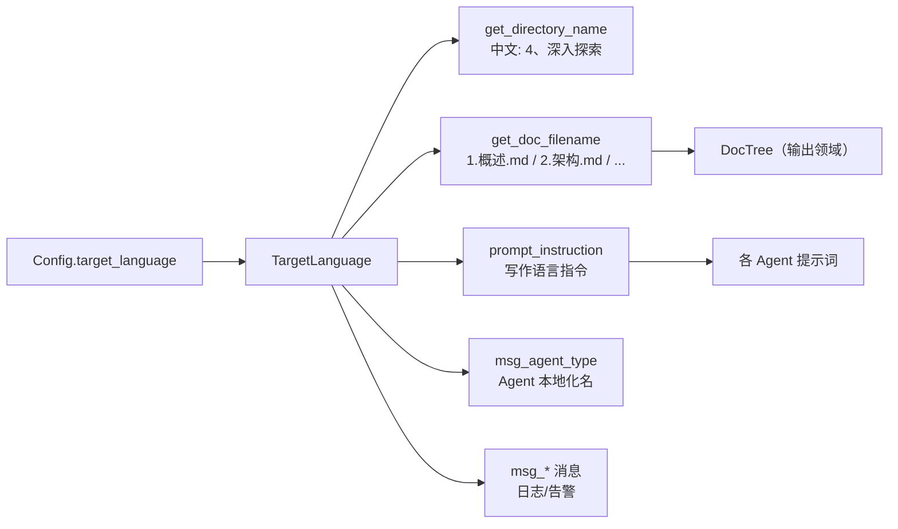

# 国际化领域

**模块路径**：`src/i18n.rs`
**生成日期**：2026-09-13

---

## 概述

国际化领域是 Litho 的"翻译局+命名处"：它用一个 `TargetLanguage` 枚举统一管理系统支持的 8 种语言，并把语言选择扩散到三个关键效力点——**文档最终的文件名**、**Agent 类型的本地化显示名**、**提示词中的写作指令**。也就是说，用户只需在配置里写下一个 `target_language = "zh"`，整套流水线从"最后文件叫什么"到"每个 LLM 提醒自己用什么语言写"都会被对齐。

这个模块很小，却承担着"多语言可信交付"的全部职责。它最妙的点在于把"文件名"做成单一事实来源（`get_doc_filename`），让中文环境下生成 `1.概述.md`、`2.架构.md`、`3.工作流.md`、`4.Deep-Exploration/`、`5.边界接口.md`、`6.数据库概览.md` 这套命名完全由一处代码决定，其余模块只需引用——改一处，处处生效。

## 核心功能点

1. **8 语言枚举**：`TargetLanguage`（`src/i18n.rs:5-22`）支持 zh/en/ja/ko/de/fr/ru/vi，带 serde rename 与 `Display`/`FromStr` 双向映射（i18n.rs:30-61），接受 `zh`/`chinese`/`中文` 等多别名。
2. **提示词写作指令**：`prompt_instruction()`（i18n.rs:79-90）为每种语言输出一段"请用 XX 语言撰写文档"的指令，注入所有 Agent 的提示词。
3. **文档文件名映射**：`get_doc_filename(doc_type)`（i18n.rs:147-157+）返回各语言下五类文档的文件名；中文下深探目录名为 `4、深入探索`（`get_directory_name`，i18n.rs:97）。
4. **Agent 显示名与消息**:`msg_*` 系列（如 `msg_agent_type`、`msg_doc_not_found`，供日志与汇总本地化）。

## 关键组件

| 组件/类型 | 文件路径 | 核心职责 |
|---------|---------|---------|
| `TargetLanguage` | `src/i18n.rs:5` | 8 语言枚举 + serde rename |
| `display_name()` | `src/i18n.rs:65` | 语言展示名 |
| `prompt_instruction()` | `src/i18n.rs:79` | 写作语言指令 |
| `get_directory_name()` | `src/i18n.rs:93` | 目录名（中文 `4、深入探索`） |
| `get_doc_filename()` | `src/i18n.rs:147` | 文档文件名（中文 `1.概述.md` 等） |
| `FromStr` | `src/i18n.rs:45` | 字符串→语言（含中文别名） |

## 内部数据流

**关键步骤说明**：
1. `Args::to_config()` 先解析 `--target-language`，再装入 `Config.target_language`（`src/cli.rs:134-138`）。
2. 输出领域构造 `DocTree` 时调用 `get_doc_filename` 得到中文文件名（`src/generator/outlet/mod.rs:25-49`）。
3. Agent 提示词组装时注入 `prompt_instruction`（在 `StepForwardAgent`/`AgentExecuteParams` 的 prompt 构建路径）。

## 关键接口与扩展点

- **`get_doc_filename(doc_type)`**：新增语言只需在 match 增加分支；新增文档类型只需扩充分支内的 `"xxx" => "名.md"` 映射。
- **`FromStr` 多别名**：用户输入 `zh`/`chinese`/`中文` 都被接受（i18n.rs:49-58），提升 CLI 可用性。
- **`msg_*` 消息族**：所有面向用户的中文文案（如文档缺失提示 `msg_doc_not_found`，被 `outlet/mod.rs:107` 使用）走本地化，是全项目文案一致性的收口。

## 与其他模块的交互

| 交互模块 | 方向 | 接口/协议 | 说明 |
|---------|------|---------|------|
| 配置管理 | 被依赖 | `Config.target_language` | 语言来自全局配置（`src/cli.rs:134-138`） |
| 输出领域 | 被依赖 | `get_doc_filename`/`get_directory_name` | 文件名与目录名的唯一来源（`src/generator/outlet/mod.rs:25-49`） |
| LLM 集成 | 被依赖 | `prompt_instruction` | Agent 提示词注入语言指令 |
| 缓存领域 | 被依赖 | `TargetLanguage` | 性能监控按语言构造（`src/cache/performance_monitor.rs:78`） |

## 跨模块协作场景

> 本模块在核心业务流程中的角色是"语言总控"：贯穿从文件名到提示词的每一个语言相关环节。

**在完整文档生成流程中**：本模块保障"中文交付"的一致性。具体参与：
- 步骤 1：解析 `--target-language zh` 得到 `TargetLanguage::Chinese`。
- 步骤 2：输出阶段 `DocTree::new(TargetLanguage)` 产出 `1.概述.md`、`4.Deep-Exploration/`（`i18n.rs:97,151-155`）。
- 步骤 3：所有 Agent 的提示词注入中文写作指令（`prompt_instruction`），从源头约束 LLM 产出中文正文。

**在错误提示/汇总场景中**：`msg_doc_not_found` 等消息保证用户在同一语言下理解系统反馈，避免"文档是中文、系统提示是英文"的割裂（`outlet/mod.rs:107`）。

## 性能考量

无性能负担（编译期枚举 + 零拷贝静态字符串）。需要注意的仅是"文件名集中式"，即避免在业务代码各处硬编码文件名——本模块通过 `DocTree`/`get_doc_filename` 收敛了这种散落，保持单点维护。

## 实现亮点

1. **文件名单一事实来源**：五类文档在 8 种语言下的命名全部收口于 `get_doc_filename`（i18n.rs:147-186+），输出侧只引用、不硬编码。
2. **别名宽容的解析**：`FromStr` 同时接受代码值（`zh`）、英文名（`chinese`）与本地名（`中文`）（i18n.rs:49-58），降低用户输入门槛。
3. **语言×效力点的正交设计**：语言选择同时影响文件名、提示词、目录名、消息——但均由同一个枚举驱动，天然一致，永远不会出现"文件名英文、正文中文"的分裂。