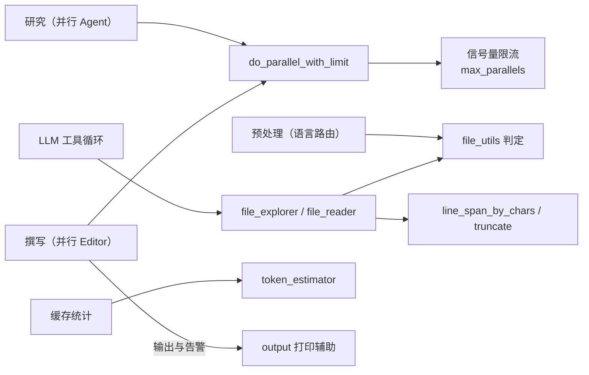

# 工具与工具集领域

**模块路径**：`src/utils/`
**生成日期**：2026-09-13

---

## 概述

工具与工具集领域是 Litho 的"五金仓库"——它没有业务逻辑，却支撑起所有阶段对"并发、估算、文件、文本、命令行输出"的公共需求。你可以把它想象成工厂里的公共工具间：车间工人（各 Agent、各提取器）按需取用扳手与卡尺，用完归位，不互相污染。它把大量"每处都可能重复写一遍"的小技能集中收纳，防止散落到各业务模块里造成重复实现与行为漂移。

它同时也是"LLM 工具集"的载体：`AgentToolFileExplorer`/`AgentToolFileReader`/`AgentToolTime`（`src/llm/tools/`）在推理循环中扮演"模型的手"，而它们对文件系统的一切判断——扩展名判定、测试文件识别、代码文件识别——都依赖这里的 `file_utils` 与 `code_utils`。因此，这块"个别名上的杂项目录"，其实是把"确定性判断"与"LLM 推理"两类逻辑缝合在一起的那个关节。

## 核心功能点

1. **并发控制**：`do_parallel_with_limit(futures, limit)`（`src/utils/threads.rs:6-27`）用信号量限制并发数，被预处理/研究/撰写各阶段并行调度复用。
2. **Token 估算**：`estimate_tokens`、`estimate_token_count`（`src/utils/token_estimator.rs`）按字符/词/字节多规则估算，供缓存统计与输入规模判别使用。
3. **字符与文本策略**：`StringExtensions::truncate`（`src/utils/chars.rs:5-56`）安全截断；`line_span_by_chars`（src/utils/code_utils.rs）按字符跨度定位行区间。
4. **文件判断集合**：`src/utils/file_utils.rs` 的 `is_code_file_path`、`is_test_file`、`is_binary_file_path` 等，是语言路由/沙箱/文件工具的统一判定来源。
5. **命令行输出**：`ansi` 退化为普通文本的打印辅助（`src/utils/` 下 `output` 相关），保证进度与告警在非 TTY 环境可读。

## 关键组件

| 组件/类型 | 文件路径 | 核心职责 |
|---------|---------|---------|
| `do_parallel_with_limit` | `src/utils/threads.rs:6` | 信号量限流的并发执行 |
| `estimate_tokens` / `estimate_token_count` | `src/utils/token_estimator.rs` | 文本 token 估算 |
| `StringExtensions::truncate` | `src/utils/chars.rs:5` | 安全截断（含末尾 `…`） |
| `line_span_by_chars` | `src/utils/code_utils.rs` | 字符跨度→行号区间 |
| `file_utils` 判定族 | `src/utils/file_utils.rs` | 代码/测试/二进制/文本判定 |
| `AgentToolFileExplorer` | `src/llm/tools/file_explorer.rs:16` | 给 LLM 的目录浏览工具 |
| `AgentToolFileReader` | `src/llm/tools/file_reader.rs:14` | 给 LLM 的文件读取工具 |
| `AgentToolTime` | `src/llm/tools/time.rs:11` | 给 LLM 的时间工具 |

## 内部数据流

**关键步骤说明**：
1. `do_parallel_with_limit` 以限流并发执行闭包/ Future 集合（`threads.rs:6-27`），各处新建线程池即用即弃。
2. LLM 文件工具调 `is_code_file_path`/`is_binary_file_path` 等判定后，再经 `resolve_path_within` 沙箱放行（`src/llm/tools/file_explorer.rs:11-14`）。
3. Token 估算被缓存指标与输入规模判别引用（`src/cache/performance_monitor.rs`）。

## 关键接口与扩展点

- **`do_parallel_with_limit(futures, limit)`**：返回迭代器/收集结果，任何"一批并行任务"都可用它统一限流（`threads.rs:6`）。
- **`file_utils` 判定函数**：新增文件类型策略在此集中维护，避免各模块自行 `ends_with` 判断。
- **`StringExtensions::truncate`**：统一截断策略（不截断非字符边界、末尾加省略号，`chars.rs:5-56`），防止散落的分割逻辑破坏 UTF-8。

## 与其他模块的交互

| 交互模块 | 方向 | 接口/协议 | 说明 |
|---------|------|---------|------|
| 预处理/研究/撰写 | 被依赖 | `do_parallel_with_limit` | 并行批次调度（agent_executor 等） |
| LLM 集成 | 被依赖 | `file_utils` / `tool` 沙箱 | 文件工具判断与路径安全（`src/llm/tools/file_explorer.rs`） |
| 缓存领域 | 被依赖 | `estimate_tokens` | 指标统计（`performance_monitor.rs`） |
| 类型体系 | 被依赖 | `CodeInsight` 截断/行跨度 | 洞察字段安全裁剪（`code.rs` via `truncate`） |

## 跨模块协作场景

> 本模块在核心业务流程中的角色是"公共工具间"：它让并行、估算、判定、文本处理这些横切能力在各阶段间保持一致。

**在并行批次执行中**：无论预处理的关系分析、研究的 `KeyModulesInsight`，还是撰写的多 Editor，都经由 `do_parallel_with_limit` 施加统一限流（受 `--max-parallels` 控制），从机制上防止并发推理打爆限流或预算。

**在 LLM 工具循环中**：`AgentToolFileExplorer` 把"目录浏览"翻译成 file_utils 判定 + `resolve_path_within` 沙箱后的结果（`file_explorer.rs:16-59`），`AgentToolFileReader` 再用 `line_span_by_chars` 精确定位行区间读取（`file_reader.rs`）——"模型的手"摸到哪里，都被这套确定性工具约束住。

**在输出与统计场景中**：`estimate_token_count` 为缓存造价与输入规模判别提供依据；打印辅助在非终端环境退化为明文，保证脚本/CI 可读。

## 性能考量

- **线程池即用即弃**：`do_parallel_with_limit` 每批创建、用完释放，规避跨批共享线程池的生命周期与容量误配问题（`threads.rs:20-27`）。
- **O(n) 判定全家桶**：文件判定全部是扩展名/前缀字符串匹配，零 IO（`file_utils.rs`）。
- **估算近似而非精确**：token/字符估算只求相对量级，避免引入分词器开销（耗时才让"估算"变得可笑）（`token_estimator.rs`）。

## 实现亮点

1. **判定策略集中化**：`is_code_file_path`/`is_test_file` 等在一处定义，语言路由、沙箱、工具三处引用同一事实，杜绝"我认为这是代码文件"的分歧。
2. **限流即插即用**：`do_parallel_with_limit` 把并发上限做成函数签名参数，调度方显式声明"这条线最多几个并行"，从调用点即可审计成本风险（`threads.rs:6`）。
3. **工具是受限的"手"**：LLM 文件工具只暴露"浏览/读取"，且每一步都过确定性判定与路径沙箱——务实地把"代码探针"开放给模型，同时守住文件系统安全边界。