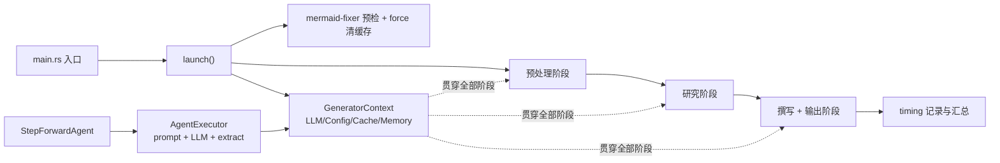

# 核心生成编排领域

**模块路径**：`src/generator/`（`workflow.rs`、`context.rs`、`types.rs`、`agent_executor.rs`、`step_forward_agent.rs`）
**生成日期**：2026-09-13

---

## 概述

核心生成编排领域是 Litho 的"总装车间主任"与"员工手册"合体。它做两件事：一是**把四个阶段按正确顺序、正确时机串起来**——`workflow::launch`（`src/generator/workflow.rs:45`）就是那条生产线的总控台，从装配全局上下文、检查外部依赖，到依次唤醒预处理、研究、撰写、输出，并记录每个阶段的耗时；二是**定义"一个 Agent 怎么写"**——`StepForwardAgent` trait（`src/generator/step_forward_agent.rs`）与 `AgentExecuteParams`（`src/generator/agent_executor.rs`）让十几个智能体都遵循同一套组装提示词、执行推理、宽容解码、落库的模板。

它不产出任何文档本身，却决定了所有文档能否产出：没有 `GeneratorContext`，任何阶段都无从下手；没有 Agent 契约，十几个各写各的智能体必然失控。它是这个系统"为什么能一致地工作"的答案所在。

## 核心功能点

1. **四阶段编排与计时**：`launch()`（`workflow.rs:45-179`）顺序执行预处理→研究→撰写→输出，每阶段耗时写入 `TimingKeys`（`workflow.rs:19-43`），支持 `--skip-*` 跳过。
2. **全局上下文装配**：`GeneratorContext`（`src/generator/context.rs`）聚合 `LLMClient`/`Config`/`CacheManager`/`Memory`，是贯穿全流程的"单例背包"。
3. **Agent 契约抽象**：`StepForwardAgent` trait 声明 `Output` 类型、`AgentType`、记忆键、`data_config`（`step_forward_agent.rs:34-82` 的 `DataSource`/`LLMCallMode`）。
4. **提示词组装与解码**：`AgentExecuteParams::prompt()` 与 `extract()`（`src/generator/agent_executor.rs`）负责"喂给 LLM 什么"与"LLM 吐的怎么接"。
5. **启动安全与依赖预检**：`--force-regenerate` 路径安全校验（`workflow.rs:51-70`）、`mermaid-fixer` 可用性检查（`workflow.rs:73-75`）。

## 关键组件

| 组件/类型 | 文件路径 | 核心职责 |
|---------|---------|---------|
| `launch()` | `src/generator/workflow.rs:45` | 四阶段总编排 + 计时 + 前置检查 |
| `TimingScope` / `TimingKeys` | `src/generator/workflow.rs:19-43` | 阶段耗时键（preprocess/research/compose/output/total） |
| `GeneratorContext` | `src/generator/context.rs` | 全局依赖背包 + `store_to_memory`/`get_from_memory` |
| `Generator` trait | `src/generator/types.rs` | 生成器契约 |
| `StepForwardAgent` trait | `src/generator/step_forward_agent.rs` | Agent 统一契约（数据源/提示词/记忆键） |
| `DataSource` / `LLMCallMode` | `src/generator/step_forward_agent.rs:34/82` | 数据源声明与调用模式 |
| `AgentExecuteParams` | `src/generator/agent_executor.rs` | 提示词组装参数 |
| `extract()` | `src/generator/agent_executor.rs` | LLM 输出 JSON 提取 |

## 内部数据流

**关键步骤说明**：
1. `launch()` 先做"破坏性操作"前置处理：需要时清 LLM 缓存（带安全校验，`workflow.rs:51-70`）。
2. `GeneratorContext` 以 `Arc<RwLock<...>>` 持有 `CacheManager` 与 `Memory`，实现并发安全共享（`workflow.rs:78-89`）。
3. 每个阶段执行后把耗时写入 `TimingScope::TIMING` 对应键（`workflow.rs:112-166`）。

## 关键接口与扩展点

- **`StepForwardAgent`**：新 Agent 三步接入——实现 trait（声明 Output/data_config/prompt）、在编排器注册、提供（或复用）lenient 解码器。预处理/研究/撰写三层都复用此抽象。
- **`DataSource` 枚举**（`step_forward_agent.rs:34`）：声明 Agent 吃哪类数据（结构/洞察/知识分类），扩展数据源只需新增变体并在 `prompt()` 格式化逻辑中加分支。
- **`LLMCallMode`**（`step_forward_agent.rs:82`）：区分不同调用形态（如稳定抽取/探索式），是提示词行为差异的开关。

## 与其他模块的交互

| 交互模块 | 方向 | 接口/协议 | 说明 |
|---------|------|---------|------|
| 配置管理 | 依赖 | `Config` | `launch(c)` 收配置并克隆入上下文（`workflow.rs:48-89`） |
| 预处理/研究/撰写/输出 | 被依赖 | `launch()` 顺序调用 | 四阶段的统一调度者（`workflow.rs:109-167`） |
| 内存管理 | 依赖 | `Memory` + timing scope | 阶段交接与计时记录（`workflow.rs:112-166`） |
| 缓存领域 | 依赖 | `CacheManager` | 装配入 Context，供全流程推理缓存（`workflow.rs:78-81`） |
| LLM 集成 | 依赖 | `LLMClient::new` | 上下文装配的唯一推理入口（`workflow.rs:77`） |
| 知识集成 | 依赖 | `KnowledgeSyncer.should_sync` | 主流程按需同步外部知识（`workflow.rs:92-102`） |

## 跨模块协作场景

> 本模块在核心业务流程中的角色是"总装车间主任+员工手册"：编排一切，定义一切 Agent 的行为规范。

**在完整文档生成流程中**：本模块是唯一的开工闸。具体参与：
- 步骤 1：`main.rs` 无子命令时调用 `launch(&config)`（`src/main.rs:27`）。
- 步骤 2：`launch()` 依次装配 Context、触发知识同步、执行三阶段（预处理/研究/撰写）、驱动输出与汇总。
- 步骤 3：各阶段共用 Context 里的 `LLMClient`/`CacheManager`/`Memory`，数据经由 `store_to_memory`/`get_from_memory` 流转（`src/generator/context.rs`）。

**在"轻量/增量运行"场景中**：`--skip-preprocessing`/`--skip-research`/`--skip-documentation` 让用户可以只跑想要的一段；`launch()` 对跳过的阶段打印明确告警（`workflow.rs:106-107`），提醒跳过是 warm-run 而非换路。

## 性能考量

- **一次装配全程复用**：Context 单次构建，避免每阶段重复创建 LLM/缓存/内存。
- **并发安全设计**：`RwLock` 让多 Agent 并行读、单点写；`llm_client` 为 `Arc` 共享，各阶段无需克隆大对象（`workflow.rs:77-89`）。
- **阶段级跳过**：把"只跑研究"这类高频调试需求变成一条 flag，避免全流程空转。

## 实现亮点

1. **"一个入口调度全流程"**：`launch()` 把编排集中在 179 行内，向后与四个阶段解耦、向上只暴露一个函数，让"流水线发生什么"可整篇通读（`workflow.rs`）。
2. **破坏性操作前置 + 安全校验**：清缓存发生在任何实质工作之前，且拒绝根目录/单段路径等危险目录（`workflow.rs:53-62`）——把"最危险的开关"放在"最容易看清的门口"。
3. **计时贯穿六个键**：`preprocess`/`research`/`compose`/`output`/`document_generation`/`total_execution`（`workflow.rs:28-43`），让"耗时在哪一段"永远可测量、可优化、可汇报。