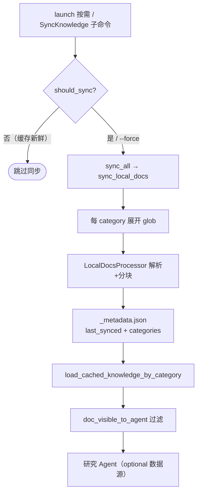

# 知识集成领域

**模块路径**：`src/integrations/`
**生成日期**：2026-09-13

---

## 概述

知识集成领域是 Litho 的"外脑接入器"——它允许把一套**既有、可信**的本地文档（架构决策记录 ADR、API 手册、数据库文档、部署文档等）注入文档生成流程，让研究/撰写 Agent 在分析代码之余，还能对照"人类已经写下的真相"做交叉核验与补充。如果说预处理/研究是"从零读懂代码"，那么知识集成就是"给解读过程配一位熟读历史的顾问"。

它的工作方式相当克制：不实时流式喂数据，而是`按类别分块存储`成一个本地缓存（`_metadata.json`），主流程启动时判断"缓存是否新鲜、需不需要重新同步"，研究 Agent 需要时再按类别按需读取。这既避免每次运行都重读一遍大文档，也让"什么时候同步"完全可预期。它提供了 `litho sync-knowledge` 子命令，也可以随主流程自动触发。

## 核心功能点

1. **按类别同步**：`sync_all`/`sync_local_docs`（`src/integrations/knowledge_sync.rs:33-144`）按 `config.knowledge.local_docs.categories` 展开 glob、解析文档、必要时分块，计数后写 `_metadata.json`（`last_synced`/`categories`）。
2. **新鲜度判断**：`should_sync`（`knowledge_sync.rs:147-220`）在缓存缺失、`watch_for_changes` 下文件集合有差集或源文件 `modified > last_synced` 时判定"需要同步"。
3. **按 Agent 可见性过滤**：`load_cached_knowledge_by_category`（knowledge_sync.rs:227-287）按 `target_agents` 与 `doc_visible_to_agent` 过滤，只让"看得到"的文档进入某 Agent 的上下文。
4. **分类名规范化**：`format_category_name`（knowledge_sync.rs:290-302）把 `architecture/database/deployment/api/adr/workflow/general` 等键翻译成可读标题。
5. **多格式本地文档处理**：`LocalDocsProcessor`（`src/integrations/local_docs.rs`，`DocFileType` 于 :40）支持 docx/md/pdf/txt/sql 等格式的解析、分块与 LLM 友好格式化。

## 关键组件

| 组件/类型 | 文件路径 | 核心职责 |
|---------|---------|---------|
| `KnowledgeSyncer` | `src/integrations/knowledge_sync.rs:22` | 同步编排 + 新鲜度判断 + 分类加载 |
| `KnowledgeMetadata` | `src/integrations/knowledge_sync.rs:13` | 同步元数据（last_synced/local_docs/categories） |
| `LocalDocsProcessor` | `src/integrations/local_docs.rs` | 文档解析/分块/格式化 |
| `LocalDocMetadata` | `src/integrations/local_docs.rs` | 单文档元数据（file_path/target_agents/类别） |
| `DocFileType` | `src/integrations/local_docs.rs:40` | 支持的文件类型枚举 |

## 内部数据流

**关键步骤说明**：
1. 主流程在 `launch()` 里 `should_sync()` 为真才同步，假则打印"缓存 up-to-date"（`src/generator/workflow.rs:92-102`）。
2. 同步结果以 `_metadata.json` 落盘到 `cache_dir`（默认 `internal_path/knowledge/local_docs`，`knowledge_sync.rs:60-68`）。
3. 研究 Agent 以 `DataSource::knowledge_categories(vec!["database","architecture"])` 作为 optional 数据源读取（如 `database_overview_analyzer.rs:41`）。

## 关键接口与扩展点

- **`KnowledgeSyncer`**：`new(config)`/`sync_all()`/`should_sync()`/`load_cached_knowledge_by_category()` 四方法与主流程解耦，也可被外部脚本独立调用。
- **配置扩展**：`config.knowledge.local_docs`（`src/config.rs`）的 `categories.enabled/paths/target_agents/chunking/default_chunking` 决定了可注入知识的形状。
- **`DocFileType`**：新增文档格式只需扩展枚举并在 `LocalDocsProcessor` 增加处理分支（`local_docs.rs:40`）。

## 与其他模块的交互

| 交互模块 | 方向 | 接口/协议 | 说明 |
|---------|------|---------|------|
| 配置管理 | 依赖 | `Config.knowledge` / `LocalDocsConfig` | 分类、路径、分块、watch 配置（`knowledge_sync.rs:39-48`） |
| 核心生成编排 | 被依赖 | `should_sync`/`sync_all` | 主流程按需触发（`src/generator/workflow.rs:92-102`） |
| 研究领域 | 被依赖 | `knowledge_categories` 数据源 | DB/边界等 Agent 的 optional 参考（`database_overview_analyzer.rs:41`） |
| 内存/缓存 | 依赖 | 磁盘缓存目录 | `_metadata.json` 持久化（`knowledge_sync.rs:60-68`） |

## 跨模块协作场景

> 本模块在核心业务流程中的角色是"外部顾问团"：为研究结论提供可交叉核验的既有知识。

**在完整文档生成流程中**：本模块首先被 `launch()` 探活。具体参与：
- 步骤 1（前置同步）：缓存过期时 `sync_all()` 将本地文档落入缓存（`knowledge_sync.rs:33-54`）。
- 步骤 2（研究注入）：`DatabaseOverviewAnalyzer` 等 Agent 把 `knowledge_categories(["database","architecture"])` 作为可选输入，比对"代码里发现的库"与"文档里记载的库"（`database_overview_analyzer.rs:60-63`）。
- 步骤 3（克制消费）：仅在缓存新鲜时启用，避免每次运行重复 IO 与反复解析大文档。

**在"litho sync-knowledge"子命令场景中**：`main.rs` 的 `SyncKnowledge` 直接加载配置并调用 `syncer.sync_all()`，`--force` 强制忽略新鲜度（`src/main.rs:40-69`）——这是"独立按需更新外脑"的显式入口。

## 性能考量

- **同步新鲜度门控**：`should_sync()` 以文件集合差集与 `modified > last_synced` 判定（`knowledge_sync.rs:191-215`），让"没变化就不干活"落到代码层面。
- **分类分块**：超大文档按 `chunking` 配置切分后再入缓存，避免单文档撑爆后续 Agent 上下文（`knowledge_sync.rs:88-116`）。
- **按需加载而非全量注入**：`load_cached_knowledge_by_category` 只取目标 Agent 可见的子集（`knowledge_sync.rs:260-287`），控制 token 成本。

## 实现亮点

1. **"外脑"的三层防线**：先新鲜度门控（不白跑）、再按类别加载（不塞错）、最后按 Agent 可见性过滤（不喂毒）——把外部知识注入做成受控、可预期、低开销的机制。
2. **与数据源体系无缝对接**：`knowledge_categories` 作为 `DataSource` 变体（`step_forward_agent.rs:34`）融入既有接口，研究 Agent 声明式声明"我参考哪类知识"，无需专门接线。
3. **观测与幂等**：`_metadata.json`（`last_synced`）既是同步状态又能支持幂等重跑——cron/CI 反复调用不会产生重复副作用。