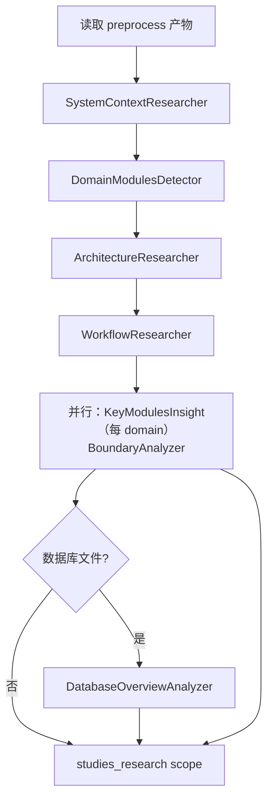

# 研究领域

**模块路径**：`src/generator/research/`
**生成日期**：2026-09-13

---

## 概述

研究领域是 Litho 对项目"真正理解"发生的地方，是整个系统的"大脑"。你可以这样理解它的位置：预处理阶段像显微镜，把源码放大成一颗颗规格明确的数据细胞；而研究领域像一名解剖学家，把这些细胞重新组装，回答"这具躯体的头在哪、手在哪、各器官如何协作"的问题。它产出的不是散碎洞察，而是层层递进的结论——从"这是什么项目"（C1）到"它由哪些领域模块构成"（C2），再到"每个模块内部长什么样、对外边界是什么"（C3），最后是可能的数据库全貌（C4）。

正因如此，这个领域质量直接决定整套文档的上限。它采用七 Agent 分工 + 严格层级推进（`ResearchOrchestrator`），并且**先有类型后有数据**——每一种报告都有精确的 Rust 结构体（`research/types.rs`）和相应的宽容解码器，LLM 的"思想"在这里第一次被固化成结构。

## 核心功能点

1. **C1 系统上下文**：`SystemContextResearcher` 判定项目类型/用户画像/外部系统/边界（`SystemContextReport`，`research/types.rs:995`）。
2. **C2 领域模块划分**：`DomainModulesDetector` 产出领域清单、域间关系、业务流与架构总结（`DomainModulesReport`，types.rs:1161）。
3. **C2b 架构/工作流专题**：`ArchitectureResearcher` 与 `WorkflowResearcher` 深化架构风格与核心流程。
4. **C3 模块洞察 + 边界**：`KeyModulesInsight` 按模块并行产出 `KeyModuleReport`（含 flowchart/sequence Mermaid，types.rs:1134）；`BoundaryAnalyzer` 产出 `BoundaryAnalysisReport`（CLI/API/路由/集成建议，types.rs:1182）。
5. **C4 数据库概览**：`DatabaseOverviewAnalyzer`（`agents/database_overview_analyzer.rs:14`）在存在 SQL 项目时分析表/视图/存储过程/关系/数据流（`DatabaseOverviewReport`，types.rs:1311）。
6. **严格 JSON 约束**：Agent 提示词要求"只能输出 JSON"，且输出结构通过 lenient 解码器容纳噪声（`database_overview_analyzer.rs:74-75`）。

## 关键组件

| 组件/类型 | 文件路径 | 核心职责 |
|---------|---------|---------|
| `ResearchOrchestrator` | `src/generator/research/orchestrator.rs` | C1→C4 顺序编排 |
| `AgentType` | `src/generator/research/types.rs:877` | 七 Agent 枚举 + 本地化显示名 |
| `SystemContextReport` | `src/generator/research/types.rs:995` | C1 产物（项目身份/边界/置信度） |
| `DomainModule` / `SubModule` | `src/generator/research/types.rs:1038/1017` | 领域与子模块（含 code_paths/importance） |
| `DomainModulesReport` | `src/generator/research/types.rs:1161` | C2 产物（域/关系/业务流/架构总结） |
| `KeyModuleReport` | `src/generator/research/types.rs:1134` | C3 逐模块洞察（含两张 Mermaid 图） |
| `BoundaryAnalysisReport` | `src/generator/research/types.rs:1182` | C3 边界（CLI/API/路由/建议） |
| `DatabaseOverviewReport` | `src/generator/research/types.rs:1311` | C4 数据库概览 |
| `STUDIES_RESEARCH` | `src/generator/research/memory.rs` | 研究产物作用域 |

## 内部数据流

**关键步骤说明**：
1. `ResearchOrchestrator` 固定顺序推进 C1→C2→C2b→C2c→C3→（C4 条件），前级结论可在后级 prompt 中引用（`orchestrator.rs`）。
2. C3 的 `KeyModulesInsight` 借助 `do_parallel_with_limit`（`src/utils/threads.rs:6-27`）对每个 domain 并行执行，产出键 `KeyModulesInsight_{domain_name}`。
3. 全部报告经 lenient 反序列化后写入 `studies_research` scope（`src/generator/research/memory.rs`）。

## 关键接口与扩展点

- **`AgentType` 枚举**（`types.rs:877`）：新增研究维度只需扩展枚举、实现 `StepForwardAgent`、在编排器中挂入合适层级。
- **`display_name(target_language)`**（types.rs:889）：Agent 名称支持 8 语言本地化，供汇总与日志。
- **各类 Report 的 lenient 解码器**：每个报告类型配 `deserialize_*_lenient` 解码器（types.rs:870 之前大量定义），是"容忍 LLM 噪声"的落点，也是扩展新报告时需要一并提供的样板。

## 与其他模块的交互

| 交互模块 | 方向 | 接口/协议 | 说明 |
|---------|------|---------|------|
| 核心生成编排 | 被依赖 | `execute_research_pipeline` | 由 `launch()` 研究阶段调用（`src/generator/workflow.rs:126-130`） |
| 预处理领域 | 依赖 | `ProjectStructure`/`CodeAndDirectoryInsights` | 几乎所有研究 Agent 的 required DataSource |
| 内存管理 | 依赖 | `STUDIES_RESEARCH` scope | 报告写入/读取（`src/generator/research/memory.rs`） |
| 组合撰写 | 被依赖 | 各类 Report | 各 Editor 直接从报告中取材成稿 |
| 知识集成 | 依赖 | `knowledge_categories` | 作为 optional DataSource 注入数据库/架构知识（`database_overview_analyzer.rs:41`） |
| LLM 集成 | 依赖 | `LLMClient` | 全部研究推理 |

## 跨模块协作场景

> 本模块在核心业务流程中的角色是"解剖学家"：把预处理的情报升级为领域结论，供撰写直取成稿。

**在完整文档生成流程中**：本模块是质量闸口。具体参与：
- 步骤 1（吸收原料）：`SystemContextResearcher` 等读取 `DataSource::PROJECT_STRUCTURE` 与 `CODE_INSIGHTS`。
- 步骤 2（递进深研）：C2 的 `DomainModulesReport` 逐层为 C3 提供了每个 `domain_name`；`KeyModulesInsightEditor` 正是按该清单逐模块生成深探文档（`src/generator/compose/mod.rs:37-40`）。
- 步骤 3（边界与 DB）：`BoundaryAnalysisReport` 为 `5.边界接口.md` 供料；`DatabaseOverviewReport` 条件触发时供料数据库文档。

**在逐模块深探文档生态中**：每个模块文档的数据来源正是 `KeyModulesInsight_{domain}` 报告——键与文档一一对应，这一约定把"研究结论"与"成稿章节"绑定了血缘关系。

## 性能考量

- **C3 并行**：逐模块洞察用 `do_parallel_with_limit` 并行（`src/utils/threads.rs`），受 `--max-parallels` 限制，平衡吞吐与限流。
- **缓存复用**：研究推理结果经 `CacheManager` 命中即免推理（`src/cache/mod.rs`）。
- **报告先行、文档殿后**：研究结论集中生成一次，避免撰写阶段重复推理；这是"研究结论"与"成稿"分层带来的本质效率优势。

## 实现亮点

1. **先类型后数据**：七个 Agent 各有精确的 Rust 报告结构（`types.rs:995-1418`），把"LLM 的模糊结论"强制固化为可检索、可引用的强类型数据——这是整套文档系统可信度的基石。
2. **分工 + 层级纪律**：C1→C4 的层级推进保证"先宏观后微观"，杜绝研究 Agent 越过边界抢答；C3 内再并行，实现"纪律与吞吐兼得"。
3. **宽进严出**：输入宽容（lenient 解码），输出严格（每份报告带 `confidence_score` 让读者评估可信度），把"LLM 不可靠"这个现实翻译成了"系统可度量、文档可存疑"的产品语言。