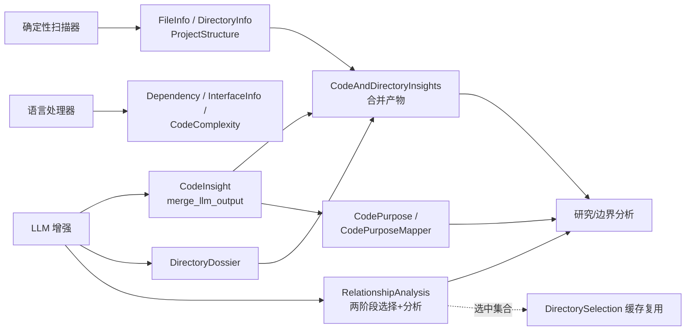

# 类型体系领域

**模块路径**：`src/types/`
**生成日期**：2026-09-13

---

## 概述

类型体系领域是 Litho 的"数据契约本"——它定义了整条流水线里几乎所有结构化数据的形状。你可以把它理解为一栋楼里所有房间门口的铭牌与承重墙图纸：确定性扫描器按 `FileInfo`/`DirectoryInfo` 的样式填报，LLM 输出结构经由 `schemars::JsonSchema` 描述、再由 lenient 解码器校准后填进 `CodeInsight`/`DirectoryDossier`/各类 Report，而 `CodePurpose` 枚举则是边界分析与目录分类共用的"功能词表"。

这个领域最值得注意的设计哲学是**"宽进宽出"**：面向机器的输入输出严格（字段齐全、序列化稳定），面向 LLM 的接缝处则处处"宽容"——`deserialize_*_lenient` 系列（`src/types/code.rs:40-110`）容忍类型漂移、缺字段、字符串化 JSON，把"模型输出不可控"这个现实消化在类型层，让上层永远见到干净的强类型数据。

## 核心功能点

1. **结构画像类型**：`FileInfo`/`DirectoryInfo`/`DirectoryPurpose`/`ProjectStructure`（`src/types/mod.rs:11-52`）承载确定性扫描输出。
2. **LLM 增强档案**：`DirectoryDossier`（`mod.rs:56`）/`FileInsight`（:74）承载目录与文件的 LLM 摘要，`CodeAndDirectoryInsights`（:104）合并两者为研究阶段主输入。
3. **代码洞察体系**：`CodeInsight`（`src/types/code.rs:276`）、`InterfaceInfo`（:324）、`Dependency`（:351）、`CodeComplexity`（:383），以及 LLM 增强合并入口 `CodeInsight::merge_llm_output`（:311）。
4. **功能分类词表**：`CodePurpose` 枚举（`code.rs:397`，26 个变体 + 宽别名）与 `CodePurposeMapper`（:549）把自由字符串归一到枚举。
5. **关系与架构类型**：`RelationshipAnalysis` 及其 `CoreDependency`（`src/types/code_releationship.rs:174`）、`ArchitectureLayer`（:199）、`DependencyType`（:215）。
6. **选择与原始文档**：`DirectorySelection`（`mod.rs:111`）支撑两阶段关系分析（`relationships_analyze.rs`）；`OriginalDocument` 承载 README 提炼（`original_document.rs`）。

## 关键组件

| 组件/类型 | 文件路径 | 核心职责 |
|---------|---------|---------|
| `FileInfo` / `DirectoryInfo` | `src/types/mod.rs:11/25` | 文件/目录画像（含重要性/复杂度分） |
| `DirectoryPurpose` | `src/types/mod.rs:37` | 目录用途分类（Core/Config/Api/Database…） |
| `DirectoryDossier` | `src/types/mod.rs:56` | LLM 目录档案（含 FileInsight） |
| `CodeAndDirectoryInsights` | `src/types/mod.rs:104` | 预处理主产物（文件+目录洞察的合并） |
| `CodeInsight` | `src/types/code.rs:276` | 单文件代码档案（职责/接口/依赖/复杂度） |
| `InterfaceInfo` / `ParameterInfo` | `src/types/code.rs:324/339` | 接口与参数描述 |
| `Dependency` | `src/types/code.rs:351` | 代码依赖（内/外、行号、类型） |
| `CodeComplexity` | `src/types/code.rs:383` | 复杂度指标（循环/行数/函数/类） |
| `CodePurpose` | `src/types/code.rs:397` | 26 值功能分类枚举 + 宽别名 |
| `CodePurposeMapper` | `src/types/code.rs:549` | 字符串→枚举归一化映射 |
| `RelationshipAnalysis` | `src/types/code_releationship.rs` | 代码关系图谱（CoreDependency/ArchitectureLayer） |
| `DirectorySelection` | `src/types/mod.rs:111` | LLM 挑选的重要目录/文件集合 |

## 内部数据流

**关键步骤说明**：
1. 确定性扫描与语言处理先产出原始画像（`types/mod.rs` + `language_processors/mod.rs`）。
2. LLM 增强结果经 `merge_llm_output` 合并进 `CodeInsight`（`code.rs:311-318`），减轻 LLM 输出结构的复杂度。
3. 关系分析的两阶段选择结果缓存为 `DirectorySelection`，供边界等后续 Agent 复用（`src/generator/preprocess/agents/relationships_analyze.rs:53-60`）。

## 关键接口与扩展点

- **`CodePurpose` + `CodePurposeMapper`**：新增分类只需扩展枚举（含 `#[serde(alias=...)]` 别名，`code.rs:397-502`）并在 `map_from_raw` 加匹配分支（:563 起）。
- **lenient 解码器族**：`deserialize_string/vec/f64/usize/option/…_lenient`（`code.rs:40-110`）是所有 LLM 输出结构复用的工具集，新报告类型可成套套用。
- **`DirectoryPurpose`**（`mod.rs:37`）：目录用途分类，是 `has_database_files()` DB 触发判定的依据之一（`src/generator/compose/mod.rs:55-72`）。

## 与其他模块的交互

| 交互模块 | 方向 | 接口/协议 | 说明 |
|---------|------|---------|------|
| 预处理领域 | 被依赖 | `CodeInsight`/`DirectoryDossier`/`RelationshipAnalysis` | 预处理全部产物类型（`src/generator/preprocess/**`） |
| 研究领域 | 被依赖 | 各类 Report 结构 | 研究报告全部在本领域外定义于 research/types.rs，但依赖 lenient 解码约定 |
| 组合撰写 | 依赖 | `DirectoryPurpose`/`CodePurpose` | DB 触发判定（`src/generator/compose/mod.rs:62-68`） |
| LLM 集成 | 依赖 | `schemars::JsonSchema` | Agent 输出描述 + 宽容解码（`src/types/code.rs:296`） |
| 工具与工具集 | 依赖 | `file_utils` | FileInfo 判定辅助（`src/llm/tools/file_explorer.rs:11`） |

## 跨模块协作场景

> 本模块在核心业务流程中的角色是"数据契约本"：它让"确定性扫描"与"LLM 语义增强"两种来源的数据能在同一套类型下无缝流动。

**在预处理→研究接力中**：`CodeAndDirectoryInsights`（`mod.rs:104`）把文件与目录洞察合并成研究阶段理解项目的"母数据"；`RelationshipAnalysis` 则为边界文档提供依赖图谱。

**在 DB 触发判定中**：`DirectoryPurpose::Database` 或 `CodePurpose::Database`（`code.rs:446`，别名"Database component"）配合 `.sql`/`.sqlproj` 扩展名共同决定是否生成数据库文档（`compose/mod.rs:62-68`）。

**在边界分析中**：`CodePurpose` 作为文件"功能属性"被 BoundaryAnalyzer 引用，决定哪些文件算"对外接口"、哪些算"内部工具"。

## 性能考量

- **体量平衡**：`CodeInsight` 保留完整字段但 `source_summary` 会截断防 token 溢出（`mod.rs:82-86`），从类型层约束了后续提示词体积。
- **合并而非重填**：`merge_llm_output`（`code.rs:311`）只在 LLM 返回非空时覆盖，减少无效解构。
- **JsonSchema 描述成本**：输出结构用 `schemars` 生成，描述精确度高但结构较大，类型设计上倾向简化 LLM 输出面（`CodeInsightLLMOutput` 只留 2 个需增强字段，`code.rs:299-306`）。

## 实现亮点

1. **"面薄背厚"的结构设计**：面向 LLM 的输出结构刻意精简（`CodeInsightLLMOutput` 仅 description+responsibilities），繁重字段与合并逻辑留在类型层（`code.rs:296-318`），降低模型遵从 JSON Schema 的难度、减少输出噪声。
2. **宽容解码收口在类型层**：所有 lenient 解码器（`code.rs:40-110`）把"模型输出不可控"消化在数据结构内部，上层 agent/撰写所见皆强类型——这是"如何与不可控对话方协作"的类型级答案。
3. **分类词表双轨归一**：`CodePurpose` 同时提供 serde alias（结构化输入）与 `CodePurposeMapper`（字符串归一），无论 LLM 输出枚举值、英文短语还是大小写任意写法，都能落到 26 个语义稳定的分类上。