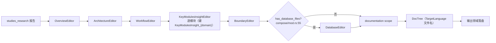

# 组合撰写领域

**模块路径**：`src/generator/compose/`
**生成日期**：2026-09-13

---

## 概述

组合撰写领域是 Litho 的"编辑车间"——它不动手分析代码，只把研究阶段已经想清楚的结论翻译成最终文档格式。把它想象成出版社：研究团队（`studies_research`）交出的是提纲与素材，编辑们（各 Editor）按既定版面把这些素材编排成定稿。整条生产线由此呈现清晰的"先想清楚再写出来"：**撰写阶段只读研究报告，绝不绕回去读源码**，这保证了成稿与结论一致、也把撰写成本控制得很轻。

它的另一个显著特点是"顺序纪律"：`DocumentationComposer::execute`（`src/generator/compose/mod.rs:24-52`）固定按 Overview → Architecture → Workflow → KeyModules（逐模块）→ Boundary → Database 顺序成稿。其中 KeyModules 的逐模块撰写直接复刻了研究阶段的模块清单，形成"研究多少模块、就写多少章节"的天然对齐。

## 核心功能点

1. **五类文档顺序成稿**：`OverviewEditor`/`ArchitectureEditor`/`WorkflowEditor`/`BoundaryEditor`/`DatabaseEditor` 依次执行（`compose/mod.rs:28-48`）。
2. **逐模块深探撰写**：`KeyModulesInsightEditor::execute`（`compose/mod.rs:37-40`）按领域模块清单逐个生成 `4.Deep-Exploration/{模块}.md`，键为 `KeyModulesInsight_{domain}`（`src/generator/compose/memory.rs` 的 DOCUMENTATION scope）。
3. **数据库条件触发**：`has_database_files()`（`compose/mod.rs:55-72`）仅当存在 Database 目录/目的或 `.sql`/`.sqlproj` 文件时才调用 `DatabaseEditor`。
4. **成稿入内存**：撰写结果写入 `DOCUMENTATION` scope，供 `DocTree` 落盘（`src/generator/outlet/mod.rs:85-90`）。

## 关键组件

| 组件/类型 | 文件路径 | 核心职责 |
|---------|---------|---------|
| `DocumentationComposer` | `src/generator/compose/mod.rs:21` | 撰写编排与 DB 触发判定 |
| `OverviewEditor` | `src/generator/compose/agents/overview_editor.rs` | 1.概述.md 成稿 |
| `ArchitectureEditor` | `src/generator/compose/agents/architecture_editor.rs` | 2.架构.md 成稿 |
| `WorkflowEditor` | `src/generator/compose/agents/workflow_editor.rs` | 3.工作流.md 成稿 |
| `KeyModulesInsightEditor` | `src/generator/compose/agents/key_modules_insight_editor.rs` | 逐模块深探文档 |
| `BoundaryEditor` | `src/generator/compose/agents/boundary_editor.rs` | 5.边界接口.md 成稿 |
| `DatabaseEditor` | `src/generator/compose/agents/database_editor.rs` | 6.数据库概览.md（条件触发） |
| `AgentType` | `src/generator/compose/types.rs:6` | Overview/Architecture/Workflow/Boundary/Database |
| `DocTree` | `src/generator/outlet/mod.rs:19` | 文档键→文件名的映射表 |

## 内部数据流

**关键步骤说明**：
1. 撰写按固定顺序推进，前面的成稿不阻塞后续模块文档生成（`compose/mod.rs:28-48`）。
2. `KeyModulesInsightEditor` 依据 `DomainModulesReport`（`studies_research` 中的 C2 报告）遍历每个 `domain_name` 逐个成稿。
3. `has_database_files()` 读取 `ScopedKeys::CODE_INSIGHTS`（`preprocess` scope），以目录/文件目的与扩展名判定是否生成数据库文档。

## 关键接口与扩展点

- **`AgentType`**（`compose/types.rs:6`）：五类文档的语义 ID，`Display` 提供英文名（"Project Overview" 等），`DocTree` 据此定位文件名。
- **`has_database_files`**（`compose/mod.rs:55-72`）：数据库文档触发的唯一闸门，判定逻辑集中于此便于调整。
- **`DocTree::insert`**（`outlet/mod.rs:51`）：新文档类型只需插入（scoped_key→相对路径）映射即接入落盘管线。

## 与其他模块的交互

| 交互模块 | 方向 | 接口/协议 | 说明 |
|---------|------|---------|------|
| 核心生成编排 | 被依赖 | `DocumentationComposer.execute` | 由 `launch()` 撰写阶段调用（`src/generator/workflow.rs:142-148`） |
| 研究领域 | 依赖 | 各类 Report | 六个 Editor 的取材对象（`compose/mod.rs` 各 agents 文件） |
| 预处理领域 | 依赖 | `CodeAndDirectoryInsights` | DB 触发判定（`compose/mod.rs:55-72`） |
| 内存管理 | 依赖 | `DOCUMENTATION` scope | 成稿存取（`src/generator/compose/memory.rs`） |
| 输出领域 | 被依赖 | `DocTree` 键对齐 | `DiskOutlet` 按键取稿落盘（`src/generator/outlet/mod.rs:85-90`） |
| 国际化 | 依赖 | `get_doc_filename` | 中文文件名映射（`src/i18n.rs:147-157`） |

## 跨模块协作场景

> 本模块在核心业务流程中的角色是"编辑排印车间"：把研究结论固化为符合版面的定稿。

**在完整文档生成流程中**：本模块把四个阶段串成接力。具体参与：
- 步骤 1：`launch()` 构造 `DocTree`（`src/generator/workflow.rs:143`）。
- 步骤 2：Overview→Architecture→Workflow 三份主文档先后成稿，各自消费 C1/C2/工作流研究报告。
- 步骤 3：`KeyModulesInsightEditor` 遍历 `DomainModulesReport.domain_modules`，每个域名产出一份深探文档；`BoundaryEditor` 产出边界文档；`DatabaseEditor` 视触发条件产出数据库文档。
- 步骤 4：成稿全部写入 `documentation` scope，由 `DiskOutlet` 一次性落盘。

**在逐模块文档生态中**：本模块与 `KeyModulesInsight` 报告形成了"一份报告一章节"的绑定——研究阶段识别的模块数量，精确等于 `4.Deep-Exploration/` 下的文档数量，保证全覆盖、不遗漏。

## 性能考量

- **撰写即翻译**：撰写的 LLM 调用面向"已经结构化的报告"，输入远比原始源码小，token 成本低。
- **逐模块独立成稿**：各模块文档互不依赖，天然可并行；实际按 `compose/mod.rs:37-40` 串行执行，如需提速可套用 `do_parallel_with_limit`（`src/utils/threads.rs`）。
- **DB 判定零推理**：`has_database_files()` 只用预处理产物做规则判断，不引入额外 LLM 调用（`compose/mod.rs:55-72`）。

## 实现亮点

1. **文档键即契约**：`AgentType::{Overview,Architecture,...}` 的键直接对应 `DocTree` 的相对路径（`outlet/mod.rs:25-49` 组装，`i18n.rs` 供给中文名），"写什么→存哪"零映射成本。
2. **条件式 DB 文档**：不迷信"每项目都有数据库"，用预处理的结构洞察做诚实判定，文档集合随项目性质自适应。
3. **纯消费不生产**：撰写阶段只读研究结论、只产成稿，与"研究在先"形成强因果链——改文档质量最有效的入口在研究阶段而非撰写提示词，这一认知被固化在架构里。