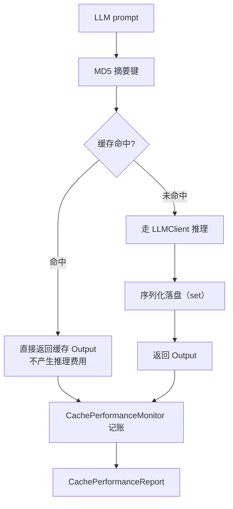

# 缓存领域

**模块路径**：`src/cache/`
**生成日期**：2026-09-13

---

## 概述

缓存领域是 Litho 的"省钱仓库"——它的存在逻辑非常朴素：**同一个 LLM 推理请求，不做第二次**。LLM 推理既贵又慢，而文档生成任务（尤其是 CI 反复运行、多语言多项目并行）天然充满重复提示词，所以 Litho 把每次推理的结构化结果以 `MD5(prompt)` 为键落盘，下次出现完全相同的请求时直接从磁盘取回，分文不花、毫秒返回。

它同时扮演记账员：`CachePerformanceMonitor` 通过原子计数器追踪命中率、节省的时间/成本/Token（`src/cache/performance_monitor.rs:11-75`），并在每次运行后的汇总报告里呈现"这次替我省了多少钱"。这个模块虽小，却是工程化工具"好用又便宜"的两块重要基石之一（另一块是双模型路由）。

## 核心功能点

1. **响应缓存**：`CacheManager` 以提示词 `MD5` 摘要为键，序列化 `Agent::Output` 到磁盘；命中直接复用（`src/cache/mod.rs`）。
2. **结构与洞察缓存**：项目结构等确定性分析结果也走缓存（如 `structure_{path}`），供观测与复用（`src/generator/preprocess/extractors/structure_extractor.rs:28-43`）。
3. **性能监控统计**：`CachePerformanceMonitor`（`src/cache/performance_monitor.rs:11`）通过 `CacheMetrics` 原子计数 hits/misses/writes/errors/节省时间与成本，产出 `CachePerformanceReport`（含分类统计 `CategoryPerformanceStats`）。
4. **缓存生命周期控制**：`--no-cache` 完全旁路；`--force-regenerate` 先清空缓存目录（带路径安全校验，`src/generator/workflow.rs:51-70`）。

## 关键组件

| 组件/类型 | 文件路径 | 核心职责 |
|---------|---------|---------|
| `CacheManager` | `src/cache/mod.rs` | MD5 键响应缓存读写、并发安全（`Arc<RwLock<...>>` 挂载于 Context） |
| `CachePerformanceMonitor` | `src/cache/performance_monitor.rs:11` | 命中率/成本/耗时统计 |
| `CacheMetrics` | `src/cache/performance_monitor.rs:19` | 原子计数器（命中/未命中/写入/错误/节省 Token） |
| `CachePerformanceReport` | `src/cache/performance_monitor.rs:40` | 汇总报告结构（hit_rate/cost_saved/performance_improvement） |
| `CategoryPerformanceStats` | `src/cache/performance_monitor.rs:68` | 按分类的命中统计 |

## 内部数据流

**关键步骤说明**：
1. 所有 Agent 推理经由 `CacheManager.get` 判命中（API 在 `src/cache/mod.rs`，被 `step_forward_agent.rs` 与各 agent 执行路径调用）。
2. 未命中才触发真实推理；成功后将 `Agent::Output` JSON 写回磁盘。
3. 监控器在每个累积点更新原子计数，运行结束汇总成报告（`performance_monitor.rs:40-75`）。

## 关键接口与扩展点

- **`CacheManager` 读写接口**：`get`/`set` 泛型化为任意 `Serialize + Deserialize` 类型，可缓存结构、洞察、报告乃至成稿。
- **缓存键派生**：`MD5(prompt)` 保证"提示词变了键就变"，天然避免脏命中；也可显式构造 `structure_{path}` 这类语义键（`structure_extractor.rs:29`）。
- **监控扩展点**：`CacheMetrics` 的原子字段就是扩展点——新增统计维度只需加字段并更新累计点（`performance_monitor.rs:19-36`）。

## 与其他模块的交互

| 交互模块 | 方向 | 接口/协议 | 说明 |
|---------|------|---------|------|
| 核心生成编排 | 被依赖 | `Context.cache_manager` | `Arc<RwLock<CacheManager>>` 挂载于 GeneratorContext（`src/generator/workflow.rs:78-81`） |
| LLM 集成 | 依赖 | MD5 响应缓存 | 推理前查缓存、后写缓存（`src/llm/client/mod.rs`） |
| 预处理 | 依赖 | `structure_{path}` 观测键 | 结构快照缓存（`structure_extractor.rs:28-43`） |
| 国际化 | 依赖 | `TargetLanguage` | 监控器按目标语言构造（`performance_monitor.rs:78`） |

## 跨模块协作场景

> 本模块在核心业务流程中的角色是"全局记账员+仓储"：任何阶段的推理结果都经过它。

**在完整文档生成流程中**：本模块承担成绩单与省钱双层职责。具体参与：
- 预处理/研究/撰写阶段：每次 `LLMClient` 推理均先经缓存判命中，未命中推理后写回。
- 输出阶段：`CachePerformanceReport` 随 `SummaryOutlet` 一并生成，呈现本次运行的命中率与节约成本（`src/generator/outlet/summary_outlet.rs`）。
- 启动阶段：`--force-regenerate` 在 `launch()` 最前清除缓存（`workflow.rs:51-70`），保证强一致重跑。

## 性能考量

- **缓存命中率是核心指标**：`performance_improvement` 直接反映缓存价值（`performance_monitor.rs:58`）。
- **并发安全**：`RwLock` 允许多读单写，适配"多 Agent 并行读、偶发写"的特征（`workflow.rs:78-81`）。
- **磁盘而非内存**：跨进程/跨运行生效，CI 场景收益最大；代价是需要管理缓存目录大小与更新策略。

## 实现亮点

1. **提示词 MD5 键**：缓存键与"请求内容"严格绑定，杜绝旧缓存污染新结果，也省去版本号维护。
2. **记账内嵌而非旁挂**：监控逻辑以原子计数嵌在缓存访问路径上，无需额外埋点就能得到全链路统计（`performance_monitor.rs`）。
3. **破坏性操作前置保护**：`--force-regenerate` 的清目录动作放在 `launch()` 最前并拒绝危险路径（`workflow.rs:53-62`），把误删风险压到最低——这是"破坏性操作要显式且权限收敛"的工程示范。