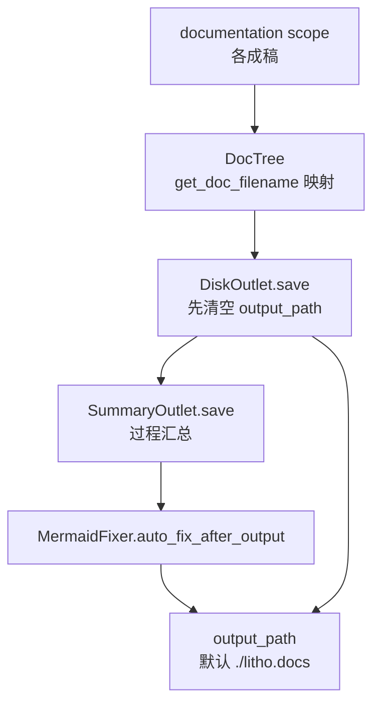

# 输出领域

**模块路径**：`src/generator/outlet/`
**生成日期**：2026-09-13

---

## 概述

输出领域是 Litho 的"打包发货车间"——它把 `documentation` 作用域里的所有成稿，按既定的中文文件名规范落到磁盘上的输出目录，并顺手做两件收尾工作：生成一份本次运行的过程汇总报告，以及调用外部 `mermaid-fixer` 对每个文档里的 Mermaid 图表做最终质检。它的设计动机很朴素：**好的文档不能只存在于内存里，更要能稳定、可预期地出现在你指定的目录**——因此它"先清空再写入"，保证每次运行都是干净的交付。

`DocTree` 是这个领域最有"约定感"的部分：它把文档类型（Overview/Architecture/…）映射成目标语言下的文件名（`src/i18n.rs:147-157`），决定"这份成稿最后叫什么名字、落在哪个目录"。输出领域是流水线的收尾，也是这套多层约定的最终兑现点。

## 核心功能点

1. **DocTree 文件名映射**：`DocTree::new(target_language)`（`src/generator/outlet/mod.rs:25-49`）把五类文档按语言映射为输出文件名（中文：`1.概述.md`、`2.架构.md`、`3.工作流.md`、`5.边界接口.md`、`6.数据库概览.md`）。
2. **磁盘落盘**：`DiskOutlet::save`（`outlet/mod.rs:74-118`）先删除并重建 `output_path`，再逐一按 DocTree 键从内存取号并写文件，自动创建父目录。
3. **过程汇总**：`SummaryOutlet`（`src/generator/outlet/summary_outlet.rs`）调用 `summary_generator` 生成运行汇总（耗时、缓存统计等）。
4. **Mermaid 质检**：`MermaidFixer`（`src/generator/outlet/fixer.rs`）在输出后执行 `auto_fix_after_output`；`is_available` 在 `launch()` 启动时预检（`src/generator/workflow.rs:73-75`）。

## 关键组件

| 组件/类型 | 文件路径 | 核心职责 |
|---------|---------|---------|
| `Outlet` trait | `src/generator/outlet/mod.rs:15` | 输出契约：`save(&GeneratorContext)` |
| `DocTree` | `src/generator/outlet/mod.rs:19` | 文档类型→文件名映射表 |
| `DiskOutlet` | `src/generator/outlet/mod.rs:64` | 清空重建目录+逐个落盘 |
| `SummaryOutlet` | `src/generator/outlet/summary_outlet.rs` | 过程汇总报告输出 |
| `SummaryGenerator` | `src/generator/outlet/summary_generator.rs` | 汇总内容生成 |
| `MermaidFixer` | `src/generator/outlet/fixer.rs` | 调用外部 mermaid-fixer 校验修复图表 |

## 内部数据流

**关键步骤说明**：
1. `DiskOutlet::save` 对存储结构逐键读取 DOCUMENTATION 作用域（`outlet/mod.rs:85-90`），缺失成稿仅 `eprintln` 告警不中断（`:105-109`）。
2. 输出完成后统一执行 Mermaid 修复，保证交付物图表可渲染（`outlet/mod.rs:115`）。
3. `launch()` 启动时预检 `MermaidFixer::is_available`，缺失直接中止（`workflow.rs:73-75`）。

## 关键接口与扩展点

- **`Outlet` trait**（`outlet/mod.rs:15`）：新输出通道只需实现 `save(&GeneratorContext)` 即接入管线。
- **`DocTree::insert(scoped_key, relative_path)`**（`outlet/mod.rs:51`）：新增文档类型通过插入一行映射接入落盘。
- **`TargetLanguage::get_doc_filename`**（`src/i18n.rs:147-157`）：文件名多语言化的单一事实来源。

## 与其他模块的交互

| 交互模块 | 方向 | 接口/协议 | 说明 |
|---------|------|---------|------|
| 核心生成编排 | 被依赖 | `DiskOutlet::new(doc_tree)` + `save` | 由 `launch()` 输出阶段调用（`src/generator/workflow.rs:155-161`） |
| 组合撰写 | 依赖 | `DocTree` 键对齐 | 成稿按撰写侧写入的相同键取出（`outlet/mod.rs:85-90`） |
| 内存管理 | 依赖 | `DOCUMENTATION` scope | 读成稿（`get_from_memory::<String>`） |
| 国际化 | 依赖 | `get_doc_filename` / `get_directory_name` | 中文文件名与 `4、深入探索` 目录名（`src/i18n.rs:97,151-155`） |
| 配置管理 | 依赖 | `Config::output_path` | 落盘目标目录（`outlet/mod.rs:78`） |

## 跨模块协作场景

> 本模块在核心业务流程中的角色是"发货口"：它是成稿第一次离开内存、出现在磁盘上的唯一出口。

**在完整文档生成流程中**：本模块收官整个流水线。具体参与：
- 步骤 1：`launch()` 构造 `DocTree` 并交给 `DiskOutlet`（`workflow.rs:143-156`）。
- 步骤 2：清空 `output_path`（`outlet/mod.rs:79-82`），逐一落盘 6 类文档。
- 步骤 3：`SummaryOutlet` 汇编耗时/缓存统计，随目录一起交付。
- 步骤 4：`MermaidFixer` 修复图表后完成质检闭环（`outlet/mod.rs:115`）。

**在"跳过撰写"等 warm-run 场景中**：当 `--skip-documentation` 被设时输出阶段也一并跳过（`workflow.rs:139-141`），保证"没写就没有物"的一致语义。

## 性能考量

- **一次交互一个文件**：写盘采用 `fs::write` 直写，markdown 体量下开销可忽略（`outlet/mod.rs:102`）。
- **先清空再重建**：保证目录状态确定，避免陈旧文件污染交付物（`outlet/mod.rs:79-82`）。
- **外部 mermaid-fixer**：修复放在最后统一执行，避免逐文档启停进程的重复开销。

## 实现亮点

1. **"确定性交付"语义**：先删目录再写，杜绝"上次的遗留文件骗过 CI"类问题——这是对可重复交付工程的细腻坚持。
2. **文件名单源化**：`DocTree` 只依赖 `get_doc_filename` 一处生成文件名，8 语言的文件命名规则因此高度集中、易维护（`src/i18n.rs:147-186+`）。
3. **缺口容忍**：个别文档缺失时告警后继续其余落盘（`outlet/mod.rs:105-109`），把"部分成功"状态如实暴露给用户而不是静默吞掉异常。