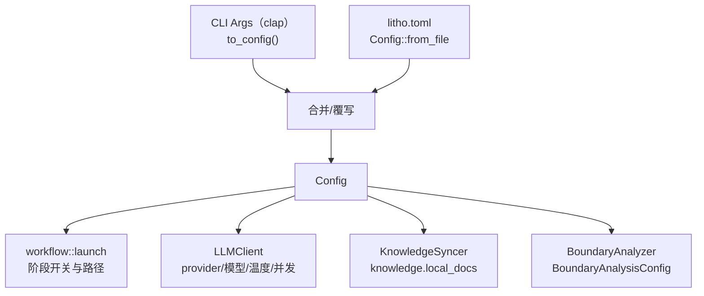

# 配置管理领域

**模块路径**：`src/config.rs`、`src/cli.rs`
**生成日期**：2026-09-13

---

## 概述

配置管理领域是整个 Litho 的"指挥中枢的开关面板"——它决定了一个二进制文件在不同机器、不同场景下拿出截然不同的表现：用哪家 LLM、花多少并发、产出哪种语言、是否跳过某个阶段。你可以把它想象成飞机驾驶舱里的仪表与按钮：飞行员（用户）不需要钻进引擎舱（业务代码），在仪表盘（CLI 参数）上就能完成 90% 的调整，而引擎舱内部的接线（Config 结构体）负责把这些调整准确传递到各个执行部件。

这个领域同时承担两副面孔：对外是 `clap` 定义的 `Args`，接收命令行；对内是贯穿全局的 `Config`。两者之间的转换函数 `Args::to_config()`（`src/cli.rs:132` 起）就是"仪表读数 → 引擎指令"的翻译器。理解它，就理解了"一个参数从终端到最后生效"的完整旅程。

## 核心功能点

1. **CLI 参数解析**：`Args` 结构体（`src/cli.rs:14-113`）用 clap 派生宏定义了 20 余个参数与子命令，覆盖路径、模型、语言、缓存、边界分析等所有可调维度；`Commands` 子命令枚举（`cli.rs:117-128`）目前支持 `SyncKnowledge`。
2. **Provider 枚举归一**：`LLMProvider`（`src/config.rs:11`）把 8 家厂商收敛成可序列化的枚举，并提供 `Display`/`FromStr` 双向映射（`config.rs:41-58`），让"模型厂商"成为一个稳定可配置的值而非散落的字符串。
3. **配置文件装载**：`Config::from_file` 支持 `litho.toml`，与 CLI 参数合并后形成最终生效配置；无配置时回退 `Config::default()`（`src/main.rs:44-55`）。
4. **边界分析专项配置**：`BoundaryAnalysisConfig`（`config.rs:229-246`，默认实现于 :780）承载 `boundary_code_limit`、`boundary_include_source`、`boundary_only_directories_when_files_more_than`，控制边界分析的信息量。

## 关键组件

| 组件/类型 | 文件路径 | 核心职责 |
|---------|---------|---------|
| `Args` | `src/cli.rs:14` | clap 参数结构，`to_config()` 归一化到 Config |
| `Commands` | `src/cli.rs:117` | `SyncKnowledge` 子命令入口 |
| `Config` | `src/config.rs` | 全局生效配置：路径/模型/语言/缓存/边界/知识源 |
| `LLMProvider` | `src/config.rs:11` | 8 家厂商枚举：openai/moonshot/deepseek/mistral/openrouter/anthropic/gemini/ollama |
| `BoundaryAnalysisConfig` | `src/config.rs:229` | 边界分析的代码量上限与信息裁剪配置 |
| `Config::default` | `src/config.rs:739` | 出厂默认值（含边界配置默认） |

## 内部数据流

**关键步骤说明**：
1. `Args::to_config()`（`src/cli.rs:132`）优先读取 `--config` 指定的 toml，再用 CLI 参数逐项覆写，最终生成 `Config`。
2. `main.rs` 默认路径将 `Config` 交给 `launch()`（`src/generator/workflow.rs:45`）；子命令路径则直接 `sync_knowledge`。

## 关键接口与扩展点

- **`Args::to_config()`**：所有 CLI 参数进入业务世界的唯一转换门。
- **`LLMProvider` 枚举扩展点**：新增厂商只需在枚举（`config.rs:11`）、`Display`/`FromStr`（`config.rs:41-58`）与 `ProviderClient::create_client`（`src/llm/client/providers.rs:44`）三处同步扩展，无需改动上层逻辑。
- **`Config::default()`**：所有配置项的"出厂值"统一在这里定义，是快速理解系统默认行为的入口（`src/config.rs:739`）。

## 与其他模块的交互

| 交互模块 | 方向 | 接口/协议 | 说明 |
|---------|------|---------|------|
| 核心生成编排 | 被依赖 | `launch()` 读取 `Config` | `launch()` 依据 skip 开关/路径/计时配置驱动流水线（`src/generator/workflow.rs:105-168`） |
| LLM 集成 | 被依赖 | `LLMProvider` + 模型字段 | `LLMClient::new(config)` 据此构造 ProviderClient（`src/llm/client/mod.rs`） |
| 知识集成 | 被依赖 | `Config::knowledge` | `KnowledgeSyncer` 读取 local_docs 配置同步知识（`src/integrations/knowledge_sync.rs:33`） |
| 国际化 | 被依赖 | `Config::target_language` | 决定文档文件名与提示词语言（`src/i18n.rs:147`） |
| 输出领域 | 被依赖 | `Config::output_path` | `DiskOutlet` 在该目录落盘（`src/generator/outlet/mod.rs:78`） |

## 跨模块协作场景

> 本模块在核心业务流程中的角色是"全局配置单"，几乎所有流程的第一步都是读取它。

**在完整文档生成流程中**：配置领域负责开局。具体参与：
- 步骤 1（`Args::to_config`）：把 CLI 参数与 toml 合并为 `Config`，交给 `launch()`。
- 步骤 2（`LLMClient::new`）：`Config` 中的 `--llm-provider`/`--model-efficient`/`--model-powerful`/`--max-parallels` 直接决定 LLM 集成领域的接线方式。
- 步骤 3（知识同步判断）：`Config.knowledge.local_docs` 的 `enabled`/`watch_for_changes` 决定是否触发 `sync_all()`（`src/generator/workflow.rs:92-102`）。

**在知识同步子命令中**：本模块提供 `Config::from_file` 加载配置并作为 `KnowledgeSyncer::new` 的唯一构造参数（`src/main.rs:40-58`）。

## 性能考量

配置领域本身几乎无性能负担（一次解析、全程只读共享），但它"间接决定性能"：并发数（`--max-parallels`/`--tool-concurrency`）、缓存开关（`--no-cache`）、强制清缓存（`--force-regenerate`）都从这里出发，直接影响流水线的耗时与成本。`--force-regenerate` 还内置了路径安全校验——拒绝清空根目录或单段路径的缓存目录，防止误毁数据（`src/generator/workflow.rs:53-62`），这类"破坏性开关"被格外小心地处理。

## 实现亮点

1. **Provider 枚举 + FromStr 双映射**（`config.rs:11-58`）：模型厂商成为类型安全的值，配套 `serde(rename_all="lowercase")` 保证 toml 与 CLI 字符串天然对齐。
2. **CLI 参数覆写优先级**：`to_config()` 的顺序设计让命令行永远高过配置文件，符合"命令行是最高指令"的直觉。
3. **边界分析配置独立成册**：把仅属于边界分析的三个参数收敛进 `BoundaryAnalysisConfig`（`config.rs:229`），避免主 `Config` 膨胀——这是"按子域收敛配置"的清晰示范。