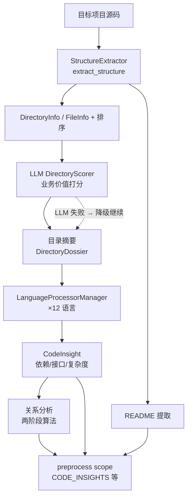

# 预处理领域

**模块路径**：`src/generator/preprocess/`
**生成日期**：2026-09-13

---

## 概述

预处理领域是 Litho 对目标项目的第一份"体检报告"生产者，也是全流水线里**确定性最强、LLM 用得最克制**的一环。你可以把它想象成工厂的进货检验车间：用最可靠的机械手段（walkdir 扫描、语言静态解析）把源码拆成标准零件，只在"这个零件有没有价值"这类需要语义判断的地方才请 LLM 出马——并且即便 LLM 缺席，流水线也照常运转。

这个领域的产出是整个系统后续理解的原料：`ProjectStructure`（目录/文件画像）、`CodeAndDirectoryInsights`（逐文件洞察与目录摘要）、`RelationshipAnalysis`（代码依赖关系图谱）。没有它，研究阶段面对的就是一堆裸文件；有了它，研究阶段拿到的是"已经被理解过一遍的压缩情报"。

## 核心功能点

1. **结构提取**：`StructureExtractor::extract_structure`（`src/generator/preprocess/extractors/structure_extractor.rs:28-100`）递归扫描目录，产出 `ProjectStructure`，支持 `git_tracked_only` 过滤（`:51`）、深度控制、文件类型/大小分布统计。
2. **LLM 目录评分**：`DirectoryScorer::score_directories`（`src/generator/preprocess/agents/directory_scoring.rs:54+`）让 LLM 评估每个目录的业务价值并给出 reasoning，据此调升关键文件的重要性分。
3. **目录摘要（Dossier）**：`directory_summary.rs` 生成 `DirectoryDossier`（purpose/summary/key_files/file_insights）。
4. **语言静态分析**：`LanguageProcessorManager`（`src/generator/preprocess/extractors/language_processors/mod.rs:31-144`）按文件扩展名路由到 12 种语言处理器，提取依赖、接口、简化复杂度指标（`calculate_complexity_metrics`，mod.rs:112-143）。
5. **关系分析**：`RelationshipsAnalyze::execute`（`src/generator/preprocess/agents/relationships_analyze.rs:27-60`）索引超限时走"先选后析"两阶段。
6. **README 提取**：`original_document_extractor.rs` 把 README 去标题/代码块后作为项目原貌信息。

## 关键组件

| 组件/类型 | 文件路径 | 核心职责 |
|---------|---------|---------|
| `PreProcessAgent` | `src/generator/preprocess/mod.rs` | 预处理编排入口 |
| `StructureExtractor` | `src/generator/preprocess/extractors/structure_extractor.rs:14` | 目录递归扫描与画像 |
| `DirectoryScorer` | `src/generator/preprocess/agents/directory_scoring.rs:46` | LLM 目录业务价值打分 |
| `DirectoryDossier` | `src/types/mod.rs:56` | LLM 生成的目录档案（含 FileInsight） |
| `LanguageProcessorManager` | `src/generator/preprocess/extractors/language_processors/mod.rs:31` | 12 语言静态分析路由 |
| `LanguageProcessor` trait | `src/generator/preprocess/extractors/language_processors/mod.rs:6` | 语言处理器契约（依赖/接口/复杂度） |
| `RelationshipsAnalyze` | `src/generator/preprocess/agents/relationships_analyze.rs:12` | 两阶段关系分析 |
| `extract`（README） | `src/generator/preprocess/extractors/original_document_extractor.rs:6` | README 精简提取 |

## 内部数据流

**关键步骤说明**：
1. `StructureExtractor` 完成确定性扫描后按其重要性重排文件（`structure_extractor.rs:78-80` 按 importance 排序）。
2. 仅当需要的语义增强缺失时任选降级：评分失败打 `eprintln` 告警跳过（`structure_extractor.rs:86-88`）。
3. 产品统一写入 `preprocess` scope 的 `ScopedKeys`（`src/generator/preprocess/memory.rs`）。

## 关键接口与扩展点

- **`LanguageProcessor` trait**（定义于 `language_processors/mod.rs:6-27`）：`supported_extensions`/`extract_dependencies`/`extract_interfaces`/`determine_component_type` 四项契约，新增语言只需实现该 trait 并在 `LanguageProcessorManager::new`（mod.rs:44-57）注册。
- **`DirectoryScoreResult`**（`directory_scoring.rs:11`）：LLM 评分输出结构，路径键控避免下标错位。
- **`DirectorySelection`**（`src/types/mod.rs:111`）：两阶段关系分析中 LLM 挑选的重要目录/文件集合，缓存供其他 Agent 复用（`relationships_analyze.rs:53-60`）。

## 与其他模块的交互

| 交互模块 | 方向 | 接口/协议 | 说明 |
|---------|------|---------|------|
| 核心生成编排 | 被依赖 | `PreProcessAgent.execute` | 由 `launch()` 预处理阶段调用（`src/generator/workflow.rs:109-111`） |
| 内存管理 | 依赖 | `MemoryScope::PREPROCESS` | 产物落 `ScopedKeys::CODE_INSIGHTS` 等（`src/generator/preprocess/memory.rs`） |
| 研究领域 | 被依赖 | `ProjectStructure` / `CodeAndDirectoryInsights` | 研究 Agent 的 required DataSource（`src/generator/research/agents/*.rs`） |
| 组合撰写 | 被依赖 | `CodeAndDirectoryInsights` | DB 触发判定读取目录 Purpose（`src/generator/compose/mod.rs:55-72`） |
| LLM 集成 | 依赖 | `LLMClient` | 目录评分/摘要/关系分析均为 LLM 调用 |
| 工具与工具集 | 依赖 | `is_test_file`、`is_binary_file_path` 等 | 文件判定与沙箱（`src/utils/file_utils.rs`） |

## 跨模块协作场景

> 本模块在核心业务流程中的角色是"进货质检车间"：它让后续所有理解都有可靠的结构化原料。

**在完整文档生成流程中**：本模块打头阵。具体参与：
- 步骤 1（结构画像）：为研究阶段提供 `ProjectStructure` 与目录/文件清单。
- 步骤 2（洞察增强）：`CodeAndDirectoryInsights` 成为研究阶段 boundary/domain 分析的核心数据源（`src/generator/research/agents/boundary_analyzer.rs` 的 required 输入）。
- 步骤 3（DB 触发）：撰写阶段 `has_database_files()` 直接消费本领域产出的目录 Purpose 判定是否生成数据库文档（`compose/mod.rs:55-72`）。

**在关系分析生态中**：若目录索引超过 `max_file_size`，本模块把一次超大推理拆成"挑选→分析"两次可控推理，并把选择结果缓存（`DirectorySelection`），让 boundary 等后续 Agent 复用同一挑选结论（`relationships_analyze.rs:53-60`）。

## 性能考量

- **确定性优先**：结构扫描与静态提取零 token 成本；LLM 只做语义增强，且失败可降级（`structure_extractor.rs:86-88`）。
- **复杂度估算轻量**：`calculate_complexity_metrics` 用字符串计数近似（`if`/`while`/`for` 等关键词），O(n) 成本换取足够信号（`language_processors/mod.rs:112-143`）。
- **两阶段关系分析**：索引大时先选后析，避免一次超长 prompt 的高价与超限风险（`relationships_analyze.rs:38-47`）。
- **选择结果复用**：`DirectorySelection` 缓存供多个 Agent 共享，避免重复挑选的重复开销。

## 实现亮点

1. **"LLM 缺席也要能跑"的韧性**：目录评分失败只是告警而非中断（`structure_extractor.rs:86-88`），配合确定性提取的兜底，把整条流水线对 LLM 的偶发失灵的敏感度降到最低。
2. **路径键控的评分结构**：`DirectoryScoreResult.path` 显式携带路径而非依赖下标，规避了 LLM 输出数组顺序与输入不一致的风险（`directory_scoring.rs:11-22`）。
3. **语言处理器插件化**：12 种语言通过 trait 对象统一注册，`get_processor` 按扩展名路由（`language_processors/mod.rs:62-72`），扩展一种新语言是"加一个文件+注册一行"的事。